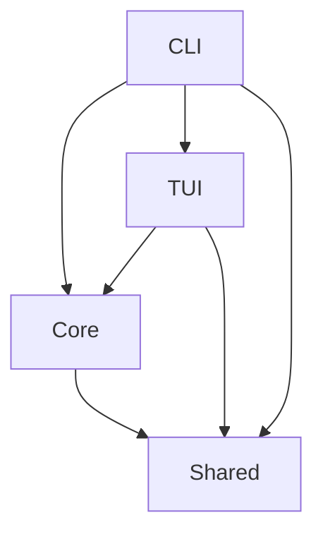

# Checklist - Interactive Task Management System

A high-performance, terminal-based interactive checklist application built with Bun and TypeScript.

## Features

- 🚀 **Blazing Fast**: Built with Bun runtime for optimal performance
- 📝 **Interactive TUI**: Rich terminal interface with keyboard navigation
- 🔄 **State Management**: YAML-based state persistence with automatic saves
- 📦 **Modular Architecture**: Clean separation between core, TUI, and CLI layers
- 🧪 **Well-Tested**: Comprehensive test coverage with Bun's native test runner
- 🎨 **Customizable**: Template-based checklist system

## Quick Start

### Prerequisites

- **Bun** 1.1.x or later
- **Git** 2.30+
- **Terminal** with 256 color and UTF-8 support

### Installation

```bash
# Clone the repository
git clone https://github.com/yourusername/checklist.git
cd checklist

# Install dependencies
bun install

# Run initial setup verification
bun test tests/smoke.test.ts

# Build all packages
bun run build:all

# Verify installation
bun run quality
```

### Development Setup

1. **Install development tools**:

   ```bash
   # Install recommended VSCode extensions
   code --install-extension dbaeumer.vscode-eslint
   code --install-extension esbenp.prettier-vscode
   code --install-extension ms-vscode.vscode-typescript-next
   ```

2. **Configure environment**:

   ```bash
   # Copy environment template
   cp .env.example .env

   # Edit .env with your settings
   ```

3. **Setup pre-commit hooks**:
   ```bash
   # Install Husky hooks
   bun run prepare
   ```

## Project Structure

```
checklist/
├── packages/           # Monorepo workspace packages
│   ├── core/          # Core business logic
│   ├── tui/           # Terminal UI components
│   ├── shared/        # Shared utilities
│   └── cli/           # CLI application
├── docs/              # Documentation
│   ├── architecture/  # Technical architecture
│   ├── prd/          # Product requirements
│   └── stories/      # User stories
└── examples/          # Usage examples
```

## Available Scripts

```bash
# Development
bun run dev          # Start development mode
bun run build        # Build all packages
bun run clean        # Clean build artifacts

# Quality
bun run lint         # Run ESLint
bun run lint:fix     # Fix linting issues
bun run format       # Format with Prettier
bun run type-check   # TypeScript type checking

# Testing
bun test            # Run all tests
bun test:watch      # Watch mode
bun test:coverage   # Generate coverage report
bun test:smoke      # Run smoke tests only

# Performance
bun run perf        # Run performance benchmarks
bun run perf:report # Generate performance report
```

## Architecture

### Core Principles

- **Separation of Concerns**: Clean boundaries between packages
- **Dependency Inversion**: Core logic doesn't depend on UI
- **State Immutability**: All state changes create new objects
- **Type Safety**: Comprehensive TypeScript coverage

### Package Dependencies



## Performance

### Targets

- **Startup Time**: < 100ms
- **Memory Usage**: < 50MB baseline
- **Binary Size**: < 10MB compiled

### Monitoring

Performance metrics are automatically tracked during tests:

```bash
# Run performance benchmarks
bun run perf

# View performance report
cat coverage/perf-report.json
```

## Testing

### Test Structure

- **Unit Tests**: Located in `packages/*/tests/` directories
- **Integration Tests**: Package interactions
- **Snapshot Tests**: TUI output validation
- **Performance Tests**: Benchmark critical paths

### Coverage Requirements

- **Minimum**: 80% overall coverage
- **Core Package**: 90% coverage target
- **New Code**: 100% coverage expected

## Contributing

See [CONTRIBUTING.md](docs/CONTRIBUTING.md) for development guidelines.

## License

MIT License - see [LICENSE](LICENSE) file for details.

## Support

- **Issues**: [GitHub Issues](https://github.com/yourusername/checklist/issues)
- **Discussions**: [GitHub Discussions](https://github.com/yourusername/checklist/discussions)
- **Documentation**: [docs/](docs/)

## Acknowledgments

Built with:

- [Bun](https://bun.sh) - Fast JavaScript runtime
- [TypeScript](https://www.typescriptlang.org) - Type safety
- [Bun Test](https://bun.sh/docs/cli/test) - Native test runner
- [ESLint](https://eslint.org) - Code quality
- [Prettier](https://prettier.io) - Code formatting
