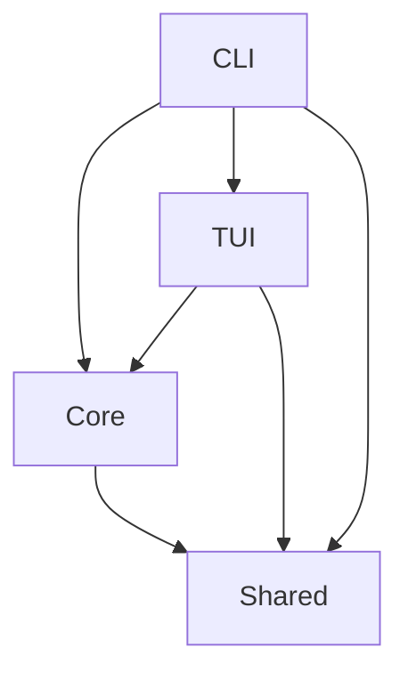

# Checklist - Interactive Task Management System

A high-performance, terminal-based interactive checklist application built with Bun, TypeScript, and Turborepo.

## Features

- 🚀 **Blazing Fast**: Built with Bun runtime and Turborepo for optimal performance
- 📝 **Interactive TUI**: Rich terminal interface with keyboard navigation
- 🔄 **State Management**: YAML-based state persistence with automatic saves
- 📦 **Modular Architecture**: Clean separation between core, TUI, and CLI layers
- 🧪 **Well-Tested**: Comprehensive test coverage (>80%) with Bun's native test runner
- 🎨 **Customizable**: Template-based checklist system
- ⚡ **Intelligent Caching**: Turborepo-powered build system with smart caching
- 📊 **Performance Monitoring**: Built-in performance dashboard with budget tracking
- 🔒 **Type-Safe**: Full TypeScript with strict mode enabled
- 📋 **Structured Logging**: Pino-based logging with structured output

## Quick Start

### Prerequisites

- **Bun** 1.1.x or later
- **Git** 2.30+
- **Terminal** with 256 color and UTF-8 support

### Installation

```bash
# Clone the repository
git clone https://github.com/yourusername/checklist.git
cd checklist

# Install dependencies
bun install

# Run initial setup verification
bun test tests/smoke.test.ts

# Build all packages (using Turborepo)
bun run build

# Verify installation
bun run quality
```

### Development Setup

1. **Install development tools**:

   ```bash
   # Install recommended VSCode extensions
   code --install-extension dbaeumer.vscode-eslint
   code --install-extension esbenp.prettier-vscode
   code --install-extension ms-vscode.vscode-typescript-next
   ```

2. **Configure environment**:

   ```bash
   # Copy environment template
   cp .env.example .env

   # Edit .env with your settings
   ```

3. **Setup pre-commit hooks**:
   ```bash
   # Install Husky hooks
   bun run prepare
   ```

## Project Structure

```
checklist/
├── packages/           # Monorepo workspace packages
│   ├── core/          # Core business logic
│   ├── tui/           # Terminal UI components
│   ├── shared/        # Shared utilities
│   └── cli/           # CLI application
├── docs/              # Documentation
│   ├── architecture/  # Technical architecture
│   ├── prd/          # Product requirements
│   └── stories/      # User stories
└── examples/          # Usage examples
```

## Available Scripts

This project uses **Turborepo** for intelligent caching and parallel task execution.

### Development Commands
```bash
bun run dev            # Start development mode (CLI package)
bun run dev:all        # Start all development servers
bun run build          # Build all packages (Turborepo)
bun run clean          # Clean build artifacts
```

### Quality Commands
```bash
bun run lint           # Run ESLint (Turborepo)
bun run lint:fix       # Fix linting issues
bun run format         # Format with Prettier (Turborepo)
bun run format:check   # Check formatting
bun run typecheck      # TypeScript type checking (Turborepo)
bun run quality        # Run all quality checks (lint + format + typecheck)
```

### Testing Commands
```bash
bun test               # Run all tests (Turborepo)
bun run test:unit      # Run unit tests only
bun run test:integration # Run integration tests
bun run test:coverage  # Generate coverage report (Turborepo)
bun run test:watch     # Watch mode
bun run test:mutation  # Run mutation testing
```

### Package-Specific Commands
```bash
# Build specific packages
turbo run build --filter=@checklist/core
turbo run build --filter=@checklist/cli
turbo run build --filter=@checklist/tui

# Test specific packages
turbo run test --filter=@checklist/shared
turbo run test:unit --filter=@checklist/core
```

### Performance Commands
```bash
bun run bench          # Run performance benchmarks
bun run bench:assert   # Validate performance thresholds
bun run bench:compare  # Compare benchmark results
```

### Turborepo Tips
```bash
# Clear cache
rm -rf .turbo

# Force rebuild (ignore cache)
turbo run build --force

# Check what would run (dry run)
turbo run build --dry-run

# Verbose output for debugging
turbo run build --verbosity=2
```

## Architecture

### Core Principles

- **Separation of Concerns**: Clean boundaries between packages
- **Dependency Inversion**: Core logic doesn't depend on UI
- **State Immutability**: All state changes create new objects
- **Type Safety**: Comprehensive TypeScript coverage

### Package Dependencies



## Performance

### Targets

- **Startup Time**: < 100ms
- **Memory Usage**: < 50MB baseline
- **Binary Size**: < 10MB compiled

### Monitoring

Performance metrics are automatically tracked during tests:

```bash
# Run performance benchmarks
bun run perf

# View performance report
cat coverage/perf-report.json
```

## Testing

### Test Structure

- **Unit Tests**: Located in `packages/*/tests/` directories
- **Integration Tests**: Package interactions
- **Snapshot Tests**: TUI output validation
- **Performance Tests**: Benchmark critical paths

### Coverage Requirements

- **Minimum**: 80% overall coverage
- **Core Package**: 90% coverage target
- **New Code**: 100% coverage expected

## Documentation

### Main Documentation
- **[Product Requirements](docs/prd.md)** - Complete product specifications
- **[Architecture Overview](docs/architecture.md)** - System architecture and design
- **[Frontend Specification](docs/front-end-spec.md)** - UI/UX detailed specifications
- **[Development Brief](docs/brief.md)** - Project overview and objectives

### Detailed Documentation
- **[Product Requirements (PRD)](docs/prd/)** - Detailed PRD documents
- **[User Stories](docs/stories/)** - Complete user stories with acceptance criteria
- **[Architecture Details](docs/architecture/)** - Technical architecture documentation
- **[Development Guides](docs/development/)** - Development workflows and guides
- **[QA Documentation](docs/qa/)** - Quality assurance and testing documentation
- **[Setup Guides](docs/guides/)** - Installation and configuration guides

### Standards & Reports
- **[Documentation Standards](docs/DOCUMENTATION-STANDARDS.md)** - Documentation guidelines
- **[Cleanup Report](docs/FINAL-CLEANUP-REPORT.md)** - Latest documentation audit
- **[Complete Audit Report](docs/COMPLETE-DOCUMENTATION-AUDIT-REPORT.md)** - Full documentation audit

## Contributing

See [CONTRIBUTING.md](docs/CONTRIBUTING.md) for development guidelines.

## License

MIT License - see [LICENSE](LICENSE) file for details.

## Support

- **Issues**: [GitHub Issues](https://github.com/yourusername/checklist/issues)
- **Discussions**: [GitHub Discussions](https://github.com/yourusername/checklist/discussions)

## Acknowledgments

Built with:

- [Bun](https://bun.sh) - Fast JavaScript runtime
- [TypeScript](https://www.typescriptlang.org) - Type safety
- [Bun Test](https://bun.sh/docs/cli/test) - Native test runner
- [ESLint](https://eslint.org) - Code quality
- [Prettier](https://prettier.io) - Code formatting
