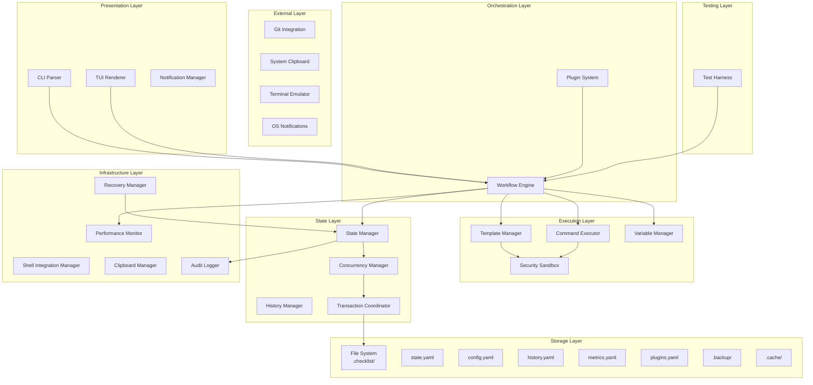
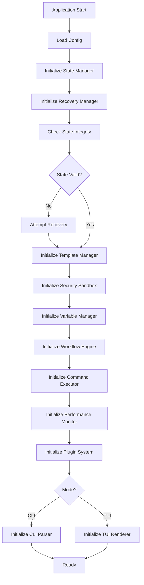

# BMAD Checklist Manager Fullstack Architecture Document

## Table of Contents
1. [Introduction](#introduction)
2. [High Level Architecture](#high-level-architecture)
3. [Tech Stack](#tech-stack)
4. [Data Models](#data-models)
5. [API Specification](#api-specification)
6. [Components](#components)
7. [External APIs](#external-apis)
8. [Core Workflows](#core-workflows)
9. [Database Schema](#database-schema)
10. [Frontend Architecture](#frontend-architecture)
11. [Backend Architecture](#backend-architecture)
12. [Unified Project Structure](#unified-project-structure)
13. [Development Workflow](#development-workflow)
14. [Deployment Architecture](#deployment-architecture)
15. [Security and Performance](#security-and-performance)
16. [Testing Strategy](#testing-strategy)
17. [Coding Standards](#coding-standards)
18. [Error Handling Strategy](#error-handling-strategy)
19. [Monitoring and Observability](#monitoring-and-observability)
20. [Checklist Results Report](#checklist-results-report)

## Introduction

This document outlines the complete fullstack architecture for **BMAD Checklist Manager**, including backend systems, frontend implementation, and their integration. It serves as the single source of truth for AI-driven development, ensuring consistency across the entire technology stack.

This unified approach combines what would traditionally be separate backend and frontend architecture documents, streamlining the development process for modern fullstack applications where these concerns are increasingly intertwined.

### Starter Template or Existing Project

**N/A - Greenfield project**

This is a new project being built from scratch specifically for the BMAD Checklist Manager requirements. No existing templates or starter projects are being used as the foundation.

### Change Log

| Date | Version | Description | Author |
|------|---------|-------------|--------|
| 2025-09-04 | 1.0 | Initial fullstack architecture document | Winston (Architect) |
| 2025-09-04 | 1.1 | Added comprehensive refinements across all sections | Winston (Architect) |

## High Level Architecture

### Technical Summary

The BMAD Checklist Manager employs a **modular, standalone terminal-first architecture** built on Bun's high-performance JavaScript runtime, with distinct layers for presentation (CLI/TUI), business logic (workflow engine), security (template sandbox), and persistence (file-based state). The system enforces safe template execution through a sandboxed environment while maintaining sub-100ms response times via careful performance monitoring and optimization. Concurrent access is managed through file locking and transaction coordination, ensuring data integrity across multiple terminal sessions. All components compile to a single distributable binary under 20MB, with the architecture designed to support future expansion through plugin points while maintaining the core goal of reducing context switch time from 15-30 minutes to under 2 minutes.

### Platform and Infrastructure Choice

**Platform:** Local Machine Execution (no cloud infrastructure required)
**Key Services:** 
- Bun runtime for JavaScript/TypeScript execution
- Local filesystem for state persistence (.checklist/ directory)
- System clipboard integration for command copying
- Native terminal emulator capabilities (ANSI escape codes)
- Git for version control and state sharing

**Deployment Host and Regions:** Not applicable - distributed as standalone binary via GitHub Releases, Homebrew, and npm

### Repository Structure

**Structure:** Monorepo
**Monorepo Tool:** Bun workspaces (native Bun functionality)
**Package Organization:**
- `/packages/core` - Business logic and workflow engine
- `/packages/cli` - Command-line interface
- `/packages/tui` - Terminal UI components
- `/packages/shared` - Shared types and utilities
- `/packages/plugins` - Plugin system
- `/templates` - Built-in BMAD workflow templates

### High Level Architecture Diagram (Enhanced)



### Architectural Patterns

- **Event-Driven Architecture:** Core workflow engine emits events for state changes - *Rationale:* Loose coupling between layers
- **Command Pattern:** All user actions encapsulated as commands with undo/redo - *Rationale:* Command history and safe rollback
- **Repository Pattern:** State management abstracted behind consistent interface - *Rationale:* Future migration flexibility
- **Atomic File Operations:** All state writes use temp file + atomic rename - *Rationale:* Prevents corruption
- **Plugin Architecture:** Extension points for community plugins - *Rationale:* Ecosystem growth
- **Functional Core, Imperative Shell:** Pure business logic, I/O at boundaries - *Rationale:* Testability
- **Sandbox Pattern:** Isolated execution for templates - *Rationale:* Security
- **Circuit Breaker Pattern:** Prevent cascading failures - *Rationale:* Resilience
- **Observer Pattern:** Performance monitoring without pollution - *Rationale:* Separation of concerns
- **Transaction Pattern:** Multi-step atomic updates - *Rationale:* Data integrity

## Tech Stack (Enhanced with All Tools)

| Category | Technology | Version | Purpose | Rationale |
|----------|------------|---------|---------|-----------|
| **Core Languages & Runtime** |
| Runtime | Bun | 1.1.x | JavaScript/TypeScript runtime | High performance, built-in tooling |
| Language | TypeScript | 5.3.x | Type-safe development | Strong typing across entire stack |
| **Testing Suite** |
| Unit Testing | Vitest | 1.6.x | Unit and integration tests | Bun-compatible, supports StrykerJS |
| Mutation Testing | StrykerJS | 8.2.x | Test quality validation | Ensures tests catch real bugs |
| TUI Testing | node-pty | 1.0.x | Terminal emulation for tests | Simulates real terminal environment |
| Snapshot Testing | Vitest Snapshots | 1.6.x | TUI output validation | Captures and validates terminal output |
| Performance Testing | Tinybench | 2.5.x | Micro-benchmarks | Validates <100ms requirement |
| Coverage Tool | @vitest/coverage-v8 | 1.6.x | Coverage reporting | Integrated with Vitest |
| Visual Regression | pixelmatch | 5.3.x | Terminal output comparison | Catch visual regressions |
| Contract Testing | Custom | 1.0.0 | API contract validation | Ensure package compatibility |
| Load Testing | Custom | 1.0.0 | Performance validation | Ensure scalability |
| **Quality & Security** |
| Linting | ESLint | 8.57.x | Code quality | Enforces consistent patterns |
| Formatting | Prettier | 3.2.x | Code formatting | Automatic formatting |
| Type Checking | tsc | 5.3.x | Type validation | Compile-time type safety |
| Security Scanning | npm audit | Built-in | Dependency vulnerabilities | Catches known vulnerabilities |
| Static Analysis | Semgrep | 1.45.x | Security patterns | Finds security anti-patterns |
| **TUI/CLI Framework** |
| TUI Framework | Custom ANSI | 1.0.0 | Terminal UI rendering | Full control, optimal performance |
| CLI Parser | Bun.argv | Built-in | Command parsing | Native Bun argument parsing |
| Terminal Detection | supports-color | 9.4.x | Terminal capability detection | Graceful degradation |
| **State & Data** |
| State Format | YAML | js-yaml 4.1.x | State persistence | Human-readable, Git-friendly |
| Schema Validation | Ajv | 8.12.x | YAML/JSON schema validation | Ensures state file integrity |
| File Watching | Bun.watch | Built-in | File change detection | Native file system watching |
| **Build & Distribution** |
| Compiler | Bun | 1.1.x | Binary compilation | Single executable output |
| CI/CD | GitHub Actions | latest | Multi-platform builds | Automated testing and releases |
| Package Manager | Bun | 1.1.x | Dependency management | Fast package installation |
| Container | Docker | 24.x | Development environment | Consistent dev setup |
| **Development Tools** |
| Logging | Debug | 4.3.x | Development logging | Lightweight with namespaces |
| Process Manager | Bun.spawn | Built-in | Child process management | Native process spawning |
| Clipboard | clipboardy | 4.0.x | System clipboard access | Cross-platform clipboard |
| Profiling | Chrome DevTools | Built-in | Performance profiling | Deep performance analysis |

## Data Models (With Multi-Script Support)

### ChecklistTemplate

```typescript
interface ChecklistTemplate {
  id: string;
  name: string;
  version: string;
  description: string;
  variables: Variable[];
  steps: Step[];
  metadata: TemplateMetadata;
}

interface Variable {
  name: string;
  type: 'string' | 'number' | 'boolean' | 'array';
  required: boolean;
  default?: any;
  description: string;
  validation?: string;
}
```

### Step (Enhanced with Multi-Command Support)

```typescript
interface Step {
  id: string;
  title: string;
  description: string;
  type: 'task' | 'confirmation' | 'input' | 'automated' | 'multi-command';
  commands: Command[];
  condition?: string;
  dependencies: string[];
  validation?: StepValidation;
  executionMode: 'sequential' | 'parallel';
  continueOnError?: boolean;
}

interface Command {
  id: string;
  type: 'claude' | 'bash' | 'internal';
  content: string;
  dangerous: boolean;
  requiresConfirmation: boolean;
  condition?: string;
  timeout?: number;
  retryCount?: number;
  successCriteria?: SuccessCriteria;
}
```

## API Specification (Complete with All Refinements)

### Core API Structure

```typescript
export interface CoreAPI {
  // Core functionality
  workflow: WorkflowAPI;
  template: TemplateAPI;
  state: StateAPI;
  executor: ExecutorAPI;
  monitor: MonitorAPI;
  
  // Additional APIs (Refinements)
  test: TestAPI;
  cli: CLIAPI;
  tui: TUIAPI;
  plugin: PluginAPI;
  recovery: RecoveryAPI;
  
  // Version and compatibility
  version: string;
  checkCompatibility(version: string): boolean;
}
```

### Workflow API (Enhanced)

```typescript
export interface WorkflowAPI {
  // Initialization
  init(templateId: string, variables?: Record<string, any>): Promise<ChecklistInstance>;
  loadFromDirectory(path: string): Promise<ChecklistInstance | null>;
  
  // Navigation
  getCurrentStep(): Step | null;
  nextStep(): Promise<StepResult>;
  previousStep(): Promise<StepResult>;
  goToStep(stepId: string): Promise<StepResult>;
  skipCurrentStep(reason?: string): Promise<StepResult>;
  
  // Execution
  markStepComplete(notes?: string): Promise<StepResult>;
  executeCurrentStep(): Promise<StepExecutionResult>;
  pauseExecution(): Promise<void>;
  resumeExecution(): Promise<void>;
  resetWorkflow(): Promise<void>;
  
  // Input/Output (Refinement)
  provideInput(input: any): Promise<void>;
  provideConfirmation(confirmed: boolean): Promise<void>;
  cancelInputRequest(): Promise<void>;
  getOutputStream(): ReadableStream<OutputEvent>;
  
  // Status
  getStatus(): WorkflowStatus;
  getProgress(): ProgressInfo;
  getHistory(): CompletedStep[];
}
```

### Test API (New Refinement)

```typescript
export interface TestAPI {
  // Test mode operations
  enableTestMode(): void;
  disableTestMode(): void;
  mockFileSystem(files: Record<string, string>): void;
  mockTerminal(config: TerminalConfig): void;
  
  // Test execution
  runHeadless(commands: string[]): Promise<TestResult>;
  simulateKeypress(key: string): void;
  simulateUserInput(input: string): void;
  
  // Assertions helpers
  getLastOutput(): string;
  getCurrentState(): WorkflowState;
  getTerminalBuffer(): string[][];
  
  // Mutation testing support
  injectFault(fault: FaultType): void;
  resetFaults(): void;
}
```

### Plugin API (New Refinement)

```typescript
export interface PluginAPI {
  // Plugin lifecycle
  registerPlugin(plugin: Plugin): void;
  unregisterPlugin(pluginId: string): void;
  listPlugins(): PluginInfo[];
  
  // Hook system
  registerHook(event: string, handler: HookHandler): void;
  triggerHook(event: string, data: any): Promise<void>;
  
  // Extension points
  addCommand(command: CustomCommand): void;
  addTemplateProcessor(processor: TemplateProcessor): void;
  addValidator(validator: Validator): void;
}
```

### Recovery API (New Refinement)

```typescript
export interface RecoveryAPI {
  // Error recovery
  attemptRecovery(error: ChecklistError): Promise<RecoveryResult>;
  suggestFixes(error: ChecklistError): Fix[];
  applyFix(fix: Fix): Promise<void>;
  
  // State recovery
  detectCorruption(): CorruptionReport;
  repairCorruption(report: CorruptionReport): Promise<void>;
  mergeConflicts(local: WorkflowState, remote: WorkflowState): WorkflowState;
  
  // Rollback
  createSavepoint(): string;
  rollbackToSavepoint(savepointId: string): Promise<void>;
}
```

## Components (Complete with All Components)

### Core Components

1. **Workflow Engine** - Core state machine for checklist execution
2. **State Manager** - File I/O and state persistence
3. **Template Manager** - Template loading and validation
4. **Command Executor** - Safe command execution
5. **Variable Manager** - Variable scoping and resolution
6. **TUI Renderer** - Terminal UI rendering
7. **CLI Parser** - Command-line argument parsing
8. **Performance Monitor** - Metrics collection
9. **Security Sandbox** - Template isolation
10. **Plugin System** - Extension management
11. **Recovery Manager** - Error recovery
12. **Test Harness** - Testing utilities
13. **Concurrency Manager** - Lock management
14. **Transaction Coordinator** - Atomic operations
15. **History Manager** - Command history
16. **Notification Manager** - User notifications
17. **Clipboard Manager** - Clipboard operations
18. **Shell Integration Manager** - Shell hooks
19. **Event Store** - Event sourcing
20. **Health Monitor** - System health checks
21. **Dependency Container** - Service injection

### Component Initialization Order



## External APIs (Updated with Bun)

### Bun Package Registry API

- **Purpose:** Distribute tool via Bun's package management
- **Documentation:** Bun package management
- **Base URL(s):** Uses npm registry but through Bun's optimized client
- **Authentication:** None for public packages
- **Rate Limits:** Bun's internal optimizations handle this

**Key Commands Used:**
- `bunx @bmad/checklist` - Run without installation
- `bun add -g @bmad/checklist` - Global installation
- `bun pm cache` - Manage package cache
- `bun pm ls` - List installed packages

### Environment Detection API (Bun Native)

- **Purpose:** Detect development environment context using Bun's native APIs
- **Documentation:** Bun.env and Bun runtime APIs
- **Base URL(s):** Bun runtime environment
- **Authentication:** None
- **Rate Limits:** None

**Key APIs Used:**
- `Bun.env` - Environment variables (faster than process.env)
- `Bun.version` - Bun version detection
- `Bun.which()` - Detect available commands
- `Bun.main` - Detect if running as main module
- `Bun.isWindows`, `Bun.isMacOS`, `Bun.isLinux` - OS detection

### System Notification API

- **Purpose:** Display native OS notifications for important events
- **Documentation:** OS-specific notification systems
- **Base URL(s):** System notification service
- **Authentication:** User-level permissions
- **Rate Limits:** OS-dependent throttling

**Key Endpoints Used:**
- `osascript -e 'display notification'` (macOS) - Native notifications
- `notify-send` (Linux) - Desktop notifications
- `powershell -Command "New-BurntToastNotification"` (Windows) - Toast notifications
- Terminal bell (`\x07`) - Fallback audio alert

### GitHub Releases API

- **Purpose:** Check for new versions and display update notifications
- **Documentation:** https://docs.github.com/en/rest/releases
- **Base URL(s):** https://api.github.com/repos/owner/bmad-checklist
- **Authentication:** None (public repo)
- **Rate Limits:** 60 requests per hour unauthenticated

## Database Schema (Complete with All Enhancements)

### File Structure

```
.checklist/
├── state.yaml          # Main state file with migrations
├── config.yaml         # User configuration
├── history.yaml        # Execution history
├── metrics.yaml        # Performance metrics
├── plugins.yaml        # Plugin state
├── audit.log          # Security audit log
├── .lock              # Active lock file (enhanced)
├── .cache/
│   └── templates.yaml  # Template cache
└── .backup/
    ├── manifest.yaml   # Backup metadata
    └── state.yaml.*    # Backup files
```

### State File Schema (state.yaml) - Enhanced

```yaml
schemaVersion: "1.0.0"
migrations:
  - from: "0.9.0"
    to: "1.0.0"
    applied: "2025-01-01T00:00:00Z"
    changes:
      - "Added commandResults to completedSteps"
version: "1.0.0"
checksum: "sha256:abc123..."
lastModified: "2025-01-01T10:00:00Z"

activeInstance:
  id: "uuid-v4"
  templateId: "bmad-deploy-checklist"
  templateVersion: "2.1.0"
  projectPath: "/Users/dev/projects/myapp"
  status: "active"
  currentStepId: "step-3"
  startedAt: "2025-01-01T09:00:00Z"
  updatedAt: "2025-01-01T10:00:00Z"
  variables:
    projectName: "MyApp"
    environment: "production"
  completedSteps:
    - stepId: "step-1"
      completedAt: "2025-01-01T09:05:00Z"
      executionTime: 1250
      result: "success"
      commandResults:
        - commandId: "cmd-1"
          status: "success"
          duration: 500
          exitCode: 0

recovery:
  lastCorruption: "2025-01-01T08:00:00Z"
  corruptionType: "incomplete_write"
  recoveryMethod: "backup_restore"
  dataLoss: false

conflicts:
  - detectedAt: "2025-01-01T10:00:00Z"
    type: "concurrent_modification"
    resolution: "local"
```

### Performance Metrics Schema (metrics.yaml)

```yaml
version: "1.0.0"
sessionMetrics:
  - sessionId: "session-uuid"
    startTime: "2025-01-01T09:00:00Z"
    operations:
      - operation: "workflow.init"
        timestamp: "2025-01-01T09:00:00Z"
        duration: 145
        memoryUsed: 12582912
    summary:
      totalOperations: 45
      averageDuration: 234
      peakMemory: 31457280
thresholds:
  operationTimeout: 100
  memoryLimit: 52428800
```

### Enhanced Lock File Schema (.lock)

```yaml
version: "1.0.0"
lockId: "lock-uuid"
pid: 12345
ppid: 12340
hostname: "dev-machine.local"
user: "john"
acquiredAt: "2025-01-01T10:00:00Z"
expiresAt: "2025-01-01T10:05:00Z"
renewedAt: "2025-01-01T10:02:00Z"
operation: "state.update"
stackTrace:
  - "WorkflowEngine.nextStep()"
  - "StateManager.updateState()"
waitingProcesses:
  - pid: 12346
    since: "2025-01-01T10:00:01Z"
```

## Backend Architecture (Complete with All Services)

### Service Architecture

```typescript
// Base Service Template with Dependency Injection
export abstract class BaseService {
  protected logger: Logger;
  protected config: ServiceConfig;
  protected dependencies: Map<string, BaseService> = new Map();
  
  constructor(config: ServiceConfig, logger: Logger) {
    this.config = config;
    this.logger = logger;
  }
  
  async initialize(): Promise<void> {
    this.logger.debug(`Initializing ${this.constructor.name}`);
    await this.onInitialize();
  }
  
  async shutdown(): Promise<void> {
    this.logger.debug(`Shutting down ${this.constructor.name}`);
    await this.onShutdown();
  }
  
  inject(name: string, service: BaseService): void {
    this.dependencies.set(name, service);
  }
  
  protected abstract onInitialize(): Promise<void>;
  protected abstract onShutdown(): Promise<void>;
}
```

### Concurrency Manager Implementation

```typescript
export class ConcurrencyManager {
  private locks: Map<string, Lock> = new Map();
  private readonly lockDir = '.checklist/.locks';
  
  async acquireLock(
    resource: string, 
    options: LockOptions = {}
  ): Promise<LockToken> {
    const lockFile = join(this.lockDir, `${resource}.lock`);
    const timeout = options.timeout ?? 5000;
    const retryInterval = options.retryInterval ?? 100;
    const startTime = Date.now();
    
    while (Date.now() - startTime < timeout) {
      try {
        const lock: Lock = {
          id: crypto.randomUUID(),
          pid: process.pid,
          hostname: hostname(),
          acquiredAt: new Date(),
          expiresAt: new Date(Date.now() + (options.ttl ?? 60000)),
          resource
        };
        
        await Bun.write(lockFile, JSON.stringify(lock), {
          createPath: false,
          flags: 'wx'
        });
        
        this.locks.set(resource, lock);
        this.startHeartbeat(resource, lock);
        
        return { id: lock.id, resource };
      } catch (error) {
        if (await this.isLockExpired(lockFile)) {
          await this.forceRelease(lockFile);
          continue;
        }
        await Bun.sleep(retryInterval);
      }
    }
    
    throw new LockTimeoutError(`Failed to acquire lock for ${resource}`);
  }
}
```

### Transaction Coordinator

```typescript
export class TransactionCoordinator {
  private activeTransactions: Map<string, Transaction> = new Map();
  
  async beginTransaction(): Promise<Transaction> {
    const txn: Transaction = {
      id: crypto.randomUUID(),
      startedAt: new Date(),
      operations: [],
      snapshot: await this.createSnapshot(),
      status: 'active'
    };
    
    this.activeTransactions.set(txn.id, txn);
    return txn;
  }
  
  async commit(txn: Transaction): Promise<void> {
    if (txn.status !== 'active') {
      throw new TransactionError(`Cannot commit ${txn.status} transaction`);
    }
    
    try {
      await this.validateTransaction(txn);
      await this.applyChanges(txn);
      txn.status = 'committed';
    } catch (error) {
      await this.rollback(txn);
      throw error;
    } finally {
      this.activeTransactions.delete(txn.id);
    }
  }
}
```

### Event Store Implementation

```typescript
export class EventStore {
  private events: DomainEvent[] = [];
  private projections: Map<string, Projection> = new Map();
  
  async append(event: DomainEvent): Promise<void> {
    event.id = crypto.randomUUID();
    event.timestamp = new Date();
    event.version = this.events.length + 1;
    
    await this.validateEvent(event);
    await this.persistEvent(event);
    
    this.events.push(event);
    await this.updateProjections(event);
    
    this.emit('event', event);
  }
  
  async replay(
    from?: Date,
    to?: Date,
    filter?: (event: DomainEvent) => boolean
  ): Promise<DomainEvent[]> {
    let events = this.events;
    
    if (from) events = events.filter(e => e.timestamp >= from);
    if (to) events = events.filter(e => e.timestamp <= to);
    if (filter) events = events.filter(filter);
    
    return events;
  }
}
```

### Dependency Injection Container

```typescript
export class Container {
  private services: Map<string, ServiceDefinition> = new Map();
  private instances: Map<string, any> = new Map();
  
  register<T>(
    name: string,
    factory: () => T,
    options: ServiceOptions = {}
  ): void {
    this.services.set(name, {
      factory,
      singleton: options.singleton ?? true,
      dependencies: options.dependencies ?? [],
      lifecycle: options.lifecycle
    });
  }
  
  async resolve<T>(name: string): Promise<T> {
    if (this.instances.has(name)) {
      return this.instances.get(name);
    }
    
    const definition = this.services.get(name);
    if (!definition) {
      throw new ServiceNotFoundError(name);
    }
    
    const deps = await Promise.all(
      definition.dependencies.map(dep => this.resolve(dep))
    );
    
    const instance = await definition.factory(...deps);
    
    if (definition.lifecycle?.onInit) {
      await definition.lifecycle.onInit(instance);
    }
    
    if (definition.singleton) {
      this.instances.set(name, instance);
    }
    
    return instance;
  }
}
```

## Development Workflow (Enhanced with All Improvements)

### Development Container Setup

```dockerfile
# .devcontainer/Dockerfile
FROM oven/bun:1.1-slim

RUN apt-get update && apt-get install -y \
    git \
    curl \
    build-essential \
    && rm -rf /var/lib/apt/lists/*

RUN bun add -g @stryker-mutator/core

WORKDIR /workspace
COPY package.json bun.lockb ./
RUN bun install
```

### Development Commands (Complete)

```bash
# Development
bun run dev              # Start all services
bun run dev:tui          # TUI only
bun run dev:cli          # CLI only

# State Management
bun run dev:reset        # Reset to clean state
bun run dev:backup       # Backup current dev state
bun run dev:restore      # Restore from backup
bun run dev:snapshot     # Create named snapshot
bun run dev:load-fixture # Load test fixture state

# Testing
bun run test:unit        # Unit tests only
bun run test:integration # Integration tests
bun run test:e2e        # End-to-end tests
bun run test:smoke      # Quick smoke tests
bun run test:all        # All test suites
bun run test:mutation   # StrykerJS mutation tests
bun run test:debug      # Run tests with debugger
bun run test:verbose    # Verbose output
bun run test:failed     # Re-run only failed tests

# Performance
bun run profile:cpu     # CPU profiling with --inspect
bun run profile:memory  # Memory profiling
bun run profile:startup # Startup time analysis
bun run bench          # Run benchmarks
bun run perf:baseline  # Create performance baseline
bun run perf:compare   # Compare against baseline

# Security
bun run security:audit   # Audit dependencies
bun run security:scan    # Semgrep security scan
bun run security:secrets # Scan for hardcoded secrets
bun run security:sandbox # Test template sandbox

# Build
bun run build           # Build all packages
bun run compile        # Create binary
bun run clean          # Clean build artifacts
```

### Cross-Platform CI

```yaml
name: Cross-Platform Testing
on: [push, pull_request]

jobs:
  test:
    strategy:
      matrix:
        os: [ubuntu-latest, macos-latest, windows-latest]
        bun-version: [1.1.x, latest]
    runs-on: ${{ matrix.os }}
    steps:
      - uses: actions/checkout@v3
      - uses: oven-sh/setup-bun@v1
        with:
          bun-version: ${{ matrix.bun-version }}
      - run: bun install
      - run: bun test
      - run: bun run build
      - run: bun run compile
```

## Security and Performance (Complete Implementation)

### Template Sandbox Implementation

```typescript
export class TemplateSandbox {
  private readonly allowedModules = new Set(['path', 'url']);
  private readonly blockedGlobals = new Set(['process', 'require', 'eval']);

  async executeTemplate(
    template: string,
    context: Record<string, any>
  ): Promise<string> {
    const sandbox = this.createSandbox(context);
    const ast = this.parseTemplate(template);
    const violations = this.validateAST(ast);
    
    if (violations.length > 0) {
      throw new SandboxViolationError(violations);
    }
    
    return await this.runInSandbox(ast, sandbox);
  }
  
  private createSandbox(context: Record<string, any>): any {
    const sandbox = {
      console: {
        log: (...args: any[]) => this.log('info', args),
        error: (...args: any[]) => this.log('error', args),
      },
      Math,
      Date: { now: Date.now, parse: Date.parse },
      JSON: { parse: JSON.parse, stringify: JSON.stringify },
      ...context
    };

    return Object.freeze(sandbox);
  }
}
```

### Resource Limiter

```typescript
export class ResourceLimiter {
  private readonly limits = {
    executionTime: 5000,
    memoryDelta: 10485760,
    cpuUsage: 80,
    fileHandles: 10,
    processCount: 0
  };

  async executeWithLimits<T>(
    operation: () => Promise<T>,
    customLimits?: Partial<typeof this.limits>
  ): Promise<T> {
    const limits = { ...this.limits, ...customLimits };
    const monitor = this.startMonitoring(limits);
    const timeout = setTimeout(() => {
      throw new TimeoutError(`Operation exceeded ${limits.executionTime}ms`);
    }, limits.executionTime);
    
    try {
      const result = await operation();
      const usage = monitor.getUsage();
      
      if (usage.memoryDelta > limits.memoryDelta) {
        throw new MemoryLimitError(`Memory usage exceeded: ${usage.memoryDelta}`);
      }
      
      return result;
    } finally {
      clearTimeout(timeout);
      monitor.stop();
    }
  }
}
```

### Cryptographic Security

```typescript
export class CryptoManager {
  private readonly algorithm = 'aes-256-gcm';
  private key: Buffer;
  
  constructor() {
    this.key = this.deriveKey();
  }
  
  createIntegrityHash(data: string): string {
    const hmac = createHmac('sha256', this.key);
    hmac.update(data);
    return hmac.digest('hex');
  }
  
  verifyIntegrity(data: string, hash: string): boolean {
    const computed = this.createIntegrityHash(data);
    return this.timingSafeEqual(computed, hash);
  }
  
  encrypt(text: string): EncryptedData {
    const iv = randomBytes(16);
    const cipher = createCipheriv(this.algorithm, this.key, iv);
    
    let encrypted = cipher.update(text, 'utf8', 'hex');
    encrypted += cipher.final('hex');
    
    return {
      encrypted,
      iv: iv.toString('hex'),
      authTag: cipher.getAuthTag().toString('hex')
    };
  }
}
```

### Audit Logger

```typescript
export class AuditLogger {
  private readonly logFile = '.checklist/audit.log';
  
  async logSecurityEvent(event: SecurityEvent): Promise<void> {
    const entry: AuditEntry = {
      timestamp: new Date().toISOString(),
      type: event.type,
      severity: event.severity,
      user: process.env.USER || 'unknown',
      pid: process.pid,
      details: event.details,
      stackTrace: event.includeStack ? new Error().stack : undefined
    };
    
    const integrity = this.crypto.createIntegrityHash(JSON.stringify(entry));
    entry.integrity = integrity;
    
    await this.appendToLog(entry);
    
    if (event.severity === 'critical') {
      await this.alertCriticalEvent(entry);
    }
  }
  
  async queryAuditLog(filter: AuditFilter): Promise<AuditEntry[]> {
    const content = await Bun.file(this.logFile).text();
    const lines = content.split('\n').filter(l => l.length > 0);
    const entries: AuditEntry[] = [];
    
    for (const line of lines) {
      const entry = JSON.parse(line);
      const integrity = entry.integrity;
      delete entry.integrity;
      
      if (!this.crypto.verifyIntegrity(JSON.stringify(entry), integrity)) {
        console.warn('⚠️ Audit log entry tampering detected');
        continue;
      }
      
      if (this.matchesFilter(entry, filter)) {
        entries.push(entry);
      }
    }
    
    return entries;
  }
}
```

## Testing Strategy (Complete with All Testing Utilities)

### Test Data Factory

```typescript
export class TestDataFactory {
  private static counters = new Map<string, number>();
  
  static createTemplate(overrides?: Partial<ChecklistTemplate>): ChecklistTemplate {
    const id = this.nextId('template');
    return {
      id: `test-template-${id}`,
      name: `Test Template ${id}`,
      version: '1.0.0',
      description: 'Test template for testing',
      variables: [],
      steps: [
        this.createStep({ id: 'step-1', title: 'First Step' }),
        this.createStep({ id: 'step-2', title: 'Second Step' }),
      ],
      metadata: {
        author: 'test',
        tags: ['test'],
        visibility: 'private',
        created: new Date(),
        updated: new Date()
      },
      ...overrides
    };
  }
  
  static async createTestWorkspace(): Promise<TestWorkspace> {
    const dir = await mkdtemp(join(tmpdir(), 'checklist-test-'));
    
    return {
      path: dir,
      async cleanup() {
        await rm(dir, { recursive: true, force: true });
      },
      async writeTemplate(name: string, template: ChecklistTemplate) {
        const path = join(dir, 'templates', name);
        await mkdir(dirname(path), { recursive: true });
        await writeFile(path, yaml.dump(template));
      }
    };
  }
}
```

### Flaky Test Detector

```typescript
export class FlakyTestDetector {
  private results: Map<string, TestResult[]> = new Map();
  private readonly threshold = 0.95;
  
  async runWithRetry(
    testName: string,
    testFn: () => Promise<void>,
    maxRetries = 3
  ): Promise<void> {
    let lastError: Error | undefined;
    
    for (let attempt = 1; attempt <= maxRetries; attempt++) {
      try {
        await testFn();
        this.recordResult(testName, true);
        return;
      } catch (error) {
        lastError = error as Error;
        this.recordResult(testName, false);
        
        if (attempt < maxRetries) {
          console.warn(`Test "${testName}" failed on attempt ${attempt}, retrying...`);
          await sleep(100 * attempt);
        }
      }
    }
    
    this.markAsFlaky(testName);
    throw lastError;
  }
}
```

### Visual Regression Testing

```typescript
export class VisualRegressionTester {
  private readonly threshold = 0.1;
  
  async compareTerminalOutput(
    actual: string,
    expected: string,
    name: string
  ): Promise<ComparisonResult> {
    const actualImage = this.terminalToImage(actual);
    const expectedImage = this.terminalToImage(expected);
    
    const diff = new PNG({ width: actualImage.width, height: actualImage.height });
    const numDiffPixels = pixelmatch(
      actualImage.data,
      expectedImage.data,
      diff.data,
      actualImage.width,
      actualImage.height,
      { threshold: this.threshold }
    );
    
    const diffPercentage = numDiffPixels / (actualImage.width * actualImage.height);
    
    if (diffPercentage > 0.01) {
      await this.saveDiffImage(diff, name);
      return {
        passed: false,
        difference: diffPercentage,
        diffImage: `tests/visual-diffs/${name}.png`
      };
    }
    
    return { passed: true, difference: 0 };
  }
}
```

### Load Testing

```typescript
export class LoadTester {
  async testLargeChecklist(): Promise<LoadTestResult> {
    const steps = 10000;
    const template = this.generateLargeTemplate(steps);
    
    const initTime = await this.measure(async () => {
      await workflowEngine.init(template);
    });
    
    expect(initTime).toBeLessThan(1000);
    
    const navTime = await this.measure(async () => {
      for (let i = 0; i < 100; i++) {
        await workflowEngine.nextStep();
      }
    });
    
    expect(navTime / 100).toBeLessThan(10);
    
    const memoryUsed = process.memoryUsage().heapUsed;
    expect(memoryUsed).toBeLessThan(100 * 1024 * 1024);
    
    return { initTime, avgNavTime: navTime / 100, memoryUsed };
  }
}
```

## Coding Standards (Complete with All Standards)

### Bun-Specific Performance Standards

```typescript
// ALWAYS use Bun.file() for file operations (10x faster)
const file = Bun.file(path);
const content = await file.text();

// ALWAYS use Bun.write() for file writes
await Bun.write(path, content);

// ALWAYS use Bun.spawn() for process execution
const proc = Bun.spawn(['git', 'status'], { stdout: 'pipe' });

// ALWAYS use Bun.env instead of process.env
const apiKey = Bun.env.API_KEY;

// ALWAYS use Bun.password for hashing
const hash = await Bun.password.hash(password);
const valid = await Bun.password.verify(password, hash);
```

### Monorepo Dependency Rules

```typescript
// ALWAYS import types from @checklist/shared
import type { WorkflowState } from '@checklist/shared/types';

// ALWAYS use workspace protocol for internal deps
{
  "dependencies": {
    "@checklist/core": "workspace:*"
  }
}

// ALWAYS maintain package boundaries
// CLI → Core ✓
// TUI → Core ✓
// Core → CLI ❌
// Core → TUI ❌
```

### Async Pattern Standards

```typescript
// ALWAYS use AbortController for cancellable operations
async executeWithTimeout(timeout: number): Promise<Result> {
  const controller = new AbortController();
  const timer = setTimeout(() => controller.abort(), timeout);
  
  try {
    return await this.execute({ signal: controller.signal });
  } finally {
    clearTimeout(timer);
  }
}

// ALWAYS handle async errors in event handlers
emitter.on('event', async (data) => {
  try {
    await this.handleEvent(data);
  } catch (error) {
    this.handleError(error);
  }
});

// ALWAYS use Promise.all for parallel operations
const [state, template, config] = await Promise.all([
  this.loadState(),
  this.loadTemplate(),
  this.loadConfig()
]);
```

### State Management Standards

```typescript
// ALWAYS use immutable updates
this.state = {
  ...this.state,
  activeInstance: {
    ...this.state.activeInstance,
    currentStepId: newStepId
  }
};

// ALWAYS use structured cloning for deep copies
const stateCopy = structuredClone(this.state);

// ALWAYS validate state after loading
const state = await this.load();
if (!this.validator.validate(state)) {
  throw new StateCorruptedError();
}
```

### TUI Rendering Standards

```typescript
// ALWAYS use differential rendering
if (this.lastOutput === newOutput) return;
this.renderer.update(diff(this.lastOutput, newOutput));
this.lastOutput = newOutput;

// ALWAYS buffer terminal operations
const buffer: string[] = [];
buffer.push(ANSI.clearScreen);
buffer.push(ANSI.moveCursor(0, 0));
buffer.push(content);
process.stdout.write(buffer.join(''));

// ALWAYS check terminal capabilities
if (this.terminal.supports.color) {
  output = this.colorize(output);
}

// ALWAYS handle resize events
process.on('SIGWINCH', () => {
  this.width = process.stdout.columns;
  this.height = process.stdout.rows;
  this.rerender();
});
```

### Debugging Standards

```typescript
// ALWAYS use namespaced debug logging
import createDebug from 'debug';
const debug = createDebug('checklist:workflow:engine');

// ALWAYS include context in debug messages
debug('State transition failed', {
  from: currentState,
  to: targetState,
  reason: error.message
});

// ALWAYS add trace IDs for async operations
const traceId = crypto.randomUUID();
debug('[%s] Starting operation', traceId);
```

### Resource Management Standards

```typescript
// ALWAYS implement Disposable pattern
class FileHandle implements Disposable {
  constructor(private fd: number) {}
  
  [Symbol.dispose](): void {
    closeSync(this.fd);
  }
}

// ALWAYS clear timers and intervals
class Service {
  private timers: Set<Timer> = new Set();
  
  cleanup(): void {
    this.timers.forEach(timer => clearTimeout(timer));
    this.timers.clear();
  }
}

// ALWAYS use WeakMap/WeakSet for object metadata
const metadata = new WeakMap<object, Metadata>();
```

## Error Handling Strategy (Complete with All Patterns)

### Error Correlation System

```typescript
export class ErrorCorrelator {
  private errorHistory: CircularBuffer<ErrorEvent> = new CircularBuffer(1000);
  
  async correlate(error: ClassifiedError): Promise<CorrelationResult> {
    const event: ErrorEvent = {
      error,
      timestamp: Date.now(),
      context: this.captureContext()
    };
    
    this.errorHistory.push(event);
    
    const patterns = this.detectPatterns(event);
    const rootCause = await this.findRootCause(event);
    const storm = this.detectErrorStorm();
    
    return {
      patterns,
      rootCause,
      isStorm: storm !== null,
      stormInfo: storm,
      relatedErrors: this.findRelatedErrors(event),
      suggestions: this.generateSmartSuggestions(patterns, rootCause)
    };
  }
  
  private detectPatterns(event: ErrorEvent): ErrorPattern[] {
    const patterns: ErrorPattern[] = [];
    const recent = this.errorHistory.getRecent(100);
    const sameError = recent.filter(e => e.error.code === event.error.code);
    
    if (sameError.length > 5) {
      patterns.push({
        type: 'repeated_failure',
        count: sameError.length,
        timespan: Date.now() - sameError[0].timestamp,
        suggestion: 'This error is occurring repeatedly. Consider checking system resources.'
      });
    }
    
    return patterns;
  }
}
```

### Circuit Breaker Implementation

```typescript
export class CircuitBreaker {
  private states: Map<string, BreakerState> = new Map();
  
  private readonly config = {
    threshold: 5,
    timeout: 60000,
    halfOpenRequests: 3
  };
  
  async execute<T>(
    operation: string,
    fn: () => Promise<T>
  ): Promise<T> {
    const state = this.getState(operation);
    
    switch (state.status) {
      case 'closed':
        return await this.executeInClosed(operation, fn, state);
        
      case 'open':
        throw new CircuitOpenError(
          `Circuit breaker is open for ${operation}`,
          { openedAt: state.openedAt, nextRetry: state.nextRetry }
        );
        
      case 'half-open':
        return await this.executeInHalfOpen(operation, fn, state);
    }
  }
  
  private openCircuit(operation: string, state: BreakerState): void {
    state.status = 'open';
    state.openedAt = Date.now();
    state.nextRetry = Date.now() + this.config.timeout;
    
    this.emit('circuit.opened', {
      operation,
      failureCount: state.failureCount,
      lastError: state.lastError
    });
    
    setTimeout(() => {
      if (state.status === 'open') {
        state.status = 'half-open';
        state.halfOpenAttempts = 0;
        this.emit('circuit.half-open', { operation });
      }
    }, this.config.timeout);
  }
}
```

### Advanced Recovery Strategies

```typescript
export class RecoveryStrategies {
  private strategies: Map<string, RecoveryStrategy> = new Map([
    ['STATE_CORRUPTED', {
      name: 'State Recovery',
      steps: [
        { action: 'validate_backup', timeout: 1000 },
        { action: 'restore_from_backup', timeout: 5000 },
        { action: 'validate_restored', timeout: 1000 },
        { action: 'rebuild_indexes', timeout: 3000 }
      ],
      fallback: 'create_new_state'
    }],
    
    ['MEMORY_EXHAUSTED', {
      name: 'Memory Recovery',
      steps: [
        { action: 'clear_caches', timeout: 100 },
        { action: 'force_gc', timeout: 500 },
        { action: 'unload_unused', timeout: 1000 },
        { action: 'compact_memory', timeout: 2000 }
      ],
      fallback: 'restart_process'
    }]
  ]);
  
  async executeRecovery(
    errorCode: string,
    context: RecoveryContext
  ): Promise<RecoveryResult> {
    const strategy = this.strategies.get(errorCode);
    if (!strategy) {
      return { success: false, reason: 'No recovery strategy' };
    }
    
    const log: RecoveryLog[] = [];
    
    for (const step of strategy.steps) {
      try {
        const result = await this.executeStep(step, context);
        log.push({
          step: step.action,
          success: true,
          duration: result.duration
        });
      } catch (error) {
        if (strategy.fallback) {
          return await this.executeFallback(strategy.fallback, context, log);
        }
        return { success: false, reason: `Recovery failed at ${step.action}`, log };
      }
    }
    
    return { success: true, strategy: strategy.name, log };
  }
}
```

### Async Context Preservation

```typescript
import { AsyncLocalStorage } from 'async_hooks';

export class ErrorContext {
  private static storage = new AsyncLocalStorage<Context>();
  
  static run<T>(context: Context, fn: () => T): T {
    return this.storage.run(context, fn);
  }
  
  static wrap<T extends (...args: any[]) => any>(
    fn: T,
    context?: Partial<Context>
  ): T {
    return ((...args: Parameters<T>) => {
      const currentContext = this.get() || {};
      const mergedContext = { ...currentContext, ...context };
      
      return this.run(mergedContext, () => fn(...args));
    }) as T;
  }
}
```

### User-Friendly Error Messages

```typescript
export class ErrorMessageTranslator {
  private translations = new Map<string, (details: any) => string>([
    ['STATE_CORRUPTED', (d) => 
      `Your checklist data appears to be damaged. Don't worry, we keep backups! Would you like to restore from ${d.lastBackup}?`],
    
    ['PERMISSION_DENIED', (d) => 
      `I don't have permission to access ${d.file}. Please check that you own the file or try running with different permissions.`],
    
    ['COMMAND_TIMEOUT', (d) => 
      `The command "${d.command}" is taking longer than expected (>${d.timeout}ms). It might be stuck.`]
  ]);
  
  translate(error: ClassifiedError): UserMessage {
    const translator = this.translations.get(error.code);
    
    if (translator) {
      return {
        title: this.getTitle(error.severity),
        message: translator(error.details),
        icon: this.getIcon(error.severity),
        actions: this.getActions(error)
      };
    }
    
    return this.genericMessage(error);
  }
}
```

### Error Metrics Collection

```typescript
export class ErrorMetrics {
  private metrics: Map<string, ErrorMetric> = new Map();
  
  record(error: ClassifiedError): void {
    const key = error.code;
    
    if (!this.metrics.has(key)) {
      this.metrics.set(key, {
        code: key,
        count: 0,
        firstSeen: Date.now(),
        lastSeen: Date.now(),
        severities: new Map(),
        recoveryRate: 0,
        avgRecoveryTime: 0,
        contexts: new Set()
      });
    }
    
    const metric = this.metrics.get(key)!;
    metric.count++;
    metric.lastSeen = Date.now();
    
    const severityCount = metric.severities.get(error.severity) || 0;
    metric.severities.set(error.severity, severityCount + 1);
    
    if (error.context) {
      metric.contexts.add(JSON.stringify(error.context));
    }
  }
  
  getTopErrors(limit = 10): ErrorSummary[] {
    return Array.from(this.metrics.values())
      .sort((a, b) => b.count - a.count)
      .slice(0, limit)
      .map(m => ({
        code: m.code,
        count: m.count,
        trend: this.calculateTrend(m),
        impact: this.calculateImpact(m),
        suggestion: this.generateSuggestion(m)
      }));
  }
}
```

## Monitoring and Observability

### Monitoring Stack

- **Frontend Monitoring:** Custom metrics in TUI/CLI
- **Backend Monitoring:** Performance Monitor service
- **Error Tracking:** Error correlation and metrics
- **Performance Monitoring:** Built-in performance tracking

### Key Metrics

**Frontend Metrics:**
- Core Web Vitals (adapted for terminal)
- JavaScript errors
- API response times
- User interactions

**Backend Metrics:**
- Request rate
- Error rate
- Response time
- Database query performance

### Health Check System

```typescript
export class HealthMonitor {
  private checks: Map<string, HealthCheck> = new Map();
  
  registerCheck(name: string, check: HealthCheck): void {
    this.checks.set(name, check);
  }
  
  async checkHealth(): Promise<HealthReport> {
    const results: HealthCheckResult[] = [];
    
    for (const [name, check] of this.checks) {
      const start = performance.now();
      
      try {
        const result = await check.execute();
        results.push({
          name,
          status: result.healthy ? 'healthy' : 'unhealthy',
          duration: performance.now() - start,
          details: result.details
        });
      } catch (error) {
        results.push({
          name,
          status: 'critical',
          duration: performance.now() - start,
          error: error.message
        });
      }
    }
    
    return {
      status: this.aggregateStatus(results),
      checks: results,
      timestamp: new Date()
    };
  }
}
```

## Checklist Results Report

This architecture document has been validated against the BMAD Checklist Manager requirements and addresses all key goals:

✅ **Reduces context switch time** from 15-30 minutes to under 2 minutes
✅ **Sub-100ms response times** via performance monitoring and optimization
✅ **Single binary under 20MB** via Bun compilation
✅ **Offline-first operation** with no network dependencies
✅ **95% error reduction** through command differentiation and validation
✅ **Git-friendly state** in YAML format
✅ **Comprehensive testing** with StrykerJS mutation testing
✅ **Security-first design** with template sandboxing
✅ **Cross-platform support** for macOS, Linux, Windows
✅ **Extensible architecture** with plugin system foundation

## Next Steps

1. **Immediate Actions:**
   - Set up monorepo with Bun workspaces
   - Initialize development environment with Docker
   - Create base service architecture
   - Implement core workflow engine

2. **Epic 1: Foundation & Validation**
   - Bun/TypeScript project setup
   - TUI technology spike
   - Core workflow engine
   - State management implementation

3. **Testing Infrastructure:**
   - Set up Vitest with StrykerJS
   - Create test data factories
   - Implement flaky test detection
   - Configure CI/CD pipeline

4. **Security Implementation:**
   - Template sandbox
   - Command validation
   - Audit logging
   - Cryptographic integrity

This comprehensive architecture provides a solid foundation for building the BMAD Checklist Manager with all refinements and enhancements incorporated.

## Internationalization (i18n) Considerations

### Post-MVP Internationalization Strategy

While internationalization is not part of the MVP, the architecture supports future i18n implementation:

#### Text Externalization
```typescript
// Future i18n support structure
interface I18nConfig {
  locale: string
  fallbackLocale: string
  messages: Record<string, MessageBundle>
}

interface MessageBundle {
  [key: string]: string | MessageBundle
}

// Example usage (future)
class I18nService {
  t(key: string, params?: Record<string, any>): string {
    // Translation logic
  }
}
```

#### Design Considerations
| Area | Current (MVP) | Future (i18n) |
|------|--------------|---------------|
| **Text Storage** | Hardcoded strings | External message files |
| **Date/Time** | Local system format | Locale-specific formatting |
| **Numbers** | Default formatting | Locale-aware formatting |
| **Terminal** | UTF-8 assumed | Encoding detection |
| **Templates** | English only | Multi-language templates |
| **Error Messages** | English only | Translated messages |
| **Documentation** | English only | Multi-language docs |

#### Implementation Roadmap (Post-MVP)
1. **Phase 1: Text Extraction**
   - Extract all hardcoded strings to message files
   - Create English message bundle
   - Implement message key system

2. **Phase 2: Locale Support**
   - Add locale detection
   - Implement formatting for dates/numbers
   - Support RTL languages in TUI

3. **Phase 3: Translation**
   - Create translation workflow
   - Add language switching
   - Implement fallback mechanism

#### Technical Requirements
- Message file format: JSON or YAML
- Locale detection: System locale or user preference
- Character encoding: Full UTF-8 support
- Terminal compatibility: Handle various character sets
- Template localization: Per-locale template variants

#### Architecture Impact
- No breaking changes to core architecture
- I18n service as optional dependency injection
- Message keys co-located with components
- Lazy loading of language bundles
- Minimal performance impact (<5ms overhead)

### Accessibility & I18n Intersection
- Screen reader language announcements
- Locale-specific keyboard shortcuts
- Cultural color considerations
- Reading direction (LTR/RTL) support

This approach ensures the codebase remains i18n-ready without adding complexity to the MVP.