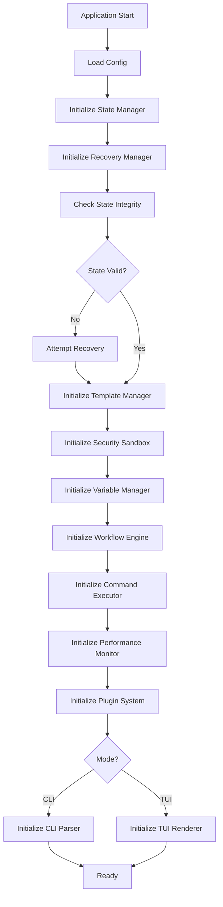

# Components (Complete with All Components)

## Core Components

1. **Workflow Engine** - Core state machine for checklist execution
2. **State Manager** - File I/O and state persistence
3. **Template Manager** - Template loading and validation
4. **Command Executor** - Safe command execution
5. **Variable Manager** - Variable scoping and resolution
6. **TUI Renderer** - Terminal UI rendering
7. **View System** - Screen/view management and navigation (Story 1.9)
8. **Terminal Canvas** - Low-level terminal rendering framework (Story 1.8)
9. **CLI Parser** - Command-line argument parsing
10. **Performance Monitor** - Metrics collection
11. **Security Sandbox** - Template isolation
12. **Plugin System** - Extension management
13. **Recovery Manager** - Error recovery
14. **Test Harness** - Testing utilities
15. **Concurrency Manager** - Lock management
16. **Transaction Coordinator** - Atomic operations
17. **History Manager** - Command history
18. **Notification Manager** - User notifications
19. **Clipboard Manager** - Clipboard operations
20. **Shell Integration Manager** - Shell hooks
21. **Event Store** - Event sourcing
22. **Health Monitor** - System health checks
23. **Dependency Container** - Service injection

## Component Initialization Order

