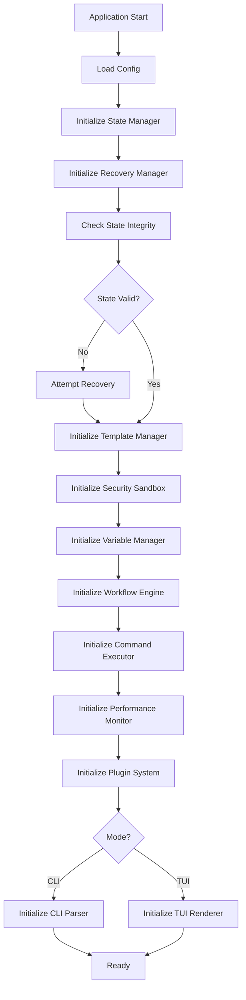

# Components (Complete with All Components)

## Core Components

1. **Workflow Engine** - Core state machine for checklist execution
2. **State Manager** - File I/O and state persistence
3. **Template Manager** - Template loading and validation
4. **Command Executor** - Safe command execution
5. **Variable Manager** - Variable scoping and resolution
6. **TUI Renderer** - Terminal UI rendering
7. **CLI Parser** - Command-line argument parsing
8. **Performance Monitor** - Metrics collection
9. **Security Sandbox** - Template isolation
10. **Plugin System** - Extension management
11. **Recovery Manager** - Error recovery
12. **Test Harness** - Testing utilities
13. **Concurrency Manager** - Lock management
14. **Transaction Coordinator** - Atomic operations
15. **History Manager** - Command history
16. **Notification Manager** - User notifications
17. **Clipboard Manager** - Clipboard operations
18. **Shell Integration Manager** - Shell hooks
19. **Event Store** - Event sourcing
20. **Health Monitor** - System health checks
21. **Dependency Container** - Service injection

## Component Initialization Order

