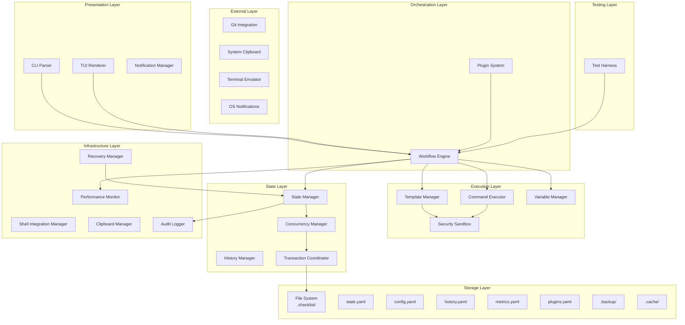

# High Level Architecture

## Technical Summary

The BMAD Checklist Manager employs a **modular, standalone terminal-first architecture** built on Bun's high-performance JavaScript runtime, with distinct layers for presentation (CLI/TUI), business logic (workflow engine), security (template sandbox), and persistence (file-based state). The system enforces safe template execution through a sandboxed environment while maintaining sub-100ms response times via careful performance monitoring and optimization. Concurrent access is managed through file locking and transaction coordination, ensuring data integrity across multiple terminal sessions. All components compile to a single distributable binary under 20MB, with the architecture designed to support future expansion through plugin points while maintaining the core goal of reducing context switch time from 15-30 minutes to under 2 minutes.

## Platform and Infrastructure Choice

**Platform:** Local Machine Execution (no cloud infrastructure required)
**Key Services:** 
- Bun runtime for JavaScript/TypeScript execution
- Local filesystem for state persistence (.checklist/ directory)
- System clipboard integration for command copying
- Native terminal emulator capabilities (ANSI escape codes)
- Git for version control and state sharing

**Deployment Host and Regions:** Not applicable - distributed as standalone binary via GitHub Releases, Homebrew, and npm

## Repository Structure

**Structure:** Monorepo
**Monorepo Tool:** Bun workspaces (native Bun functionality)
**Package Organization:**
- `/packages/core` - Business logic and workflow engine
- `/packages/cli` - Command-line interface
- `/packages/tui` - Terminal UI components
- `/packages/shared` - Shared types and utilities
- `/packages/plugins` - Plugin system
- `/templates` - Built-in BMAD workflow templates

## High Level Architecture Diagram (Enhanced)

## Architectural Patterns

- **Event-Driven Architecture:** Core workflow engine emits events for state changes - *Rationale:* Loose coupling between layers
- **Command Pattern:** All user actions encapsulated as commands with undo/redo - *Rationale:* Command history and safe rollback
- **Repository Pattern:** State management abstracted behind consistent interface - *Rationale:* Future migration flexibility
- **Atomic File Operations:** All state writes use temp file + atomic rename - *Rationale:* Prevents corruption
- **Plugin Architecture:** Extension points for community plugins - *Rationale:* Ecosystem growth
- **Functional Core, Imperative Shell:** Pure business logic, I/O at boundaries - *Rationale:* Testability
- **Sandbox Pattern:** Isolated execution for templates - *Rationale:* Security
- **Circuit Breaker Pattern:** Prevent cascading failures - *Rationale:* Resilience
- **Observer Pattern:** Performance monitoring without pollution - *Rationale:* Separation of concerns
- **Transaction Pattern:** Multi-step atomic updates - *Rationale:* Data integrity
