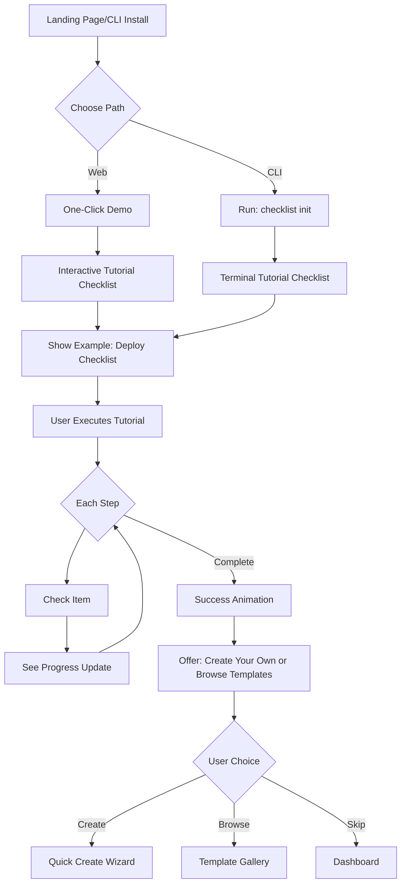
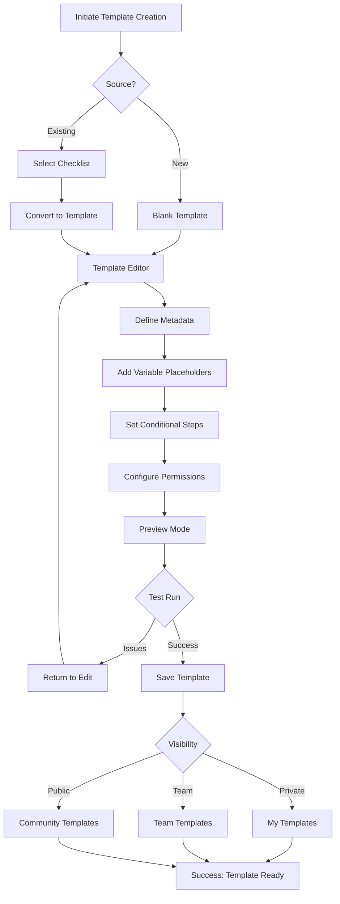
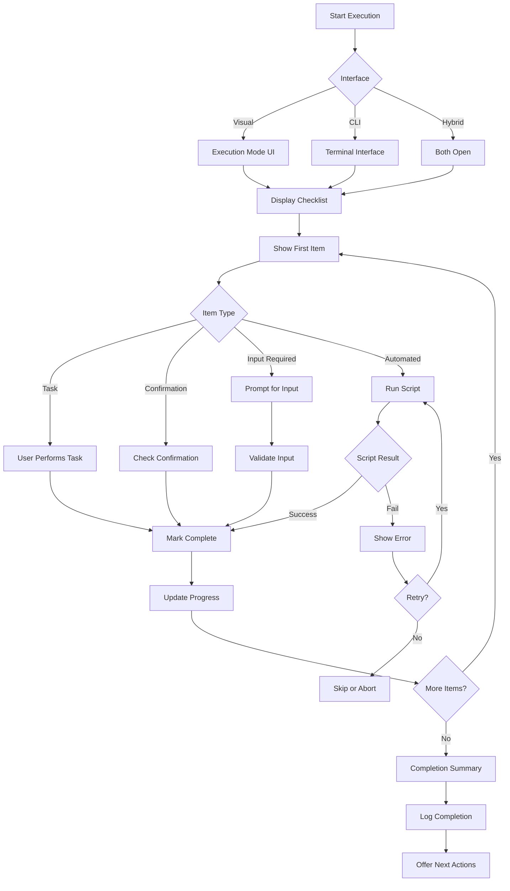
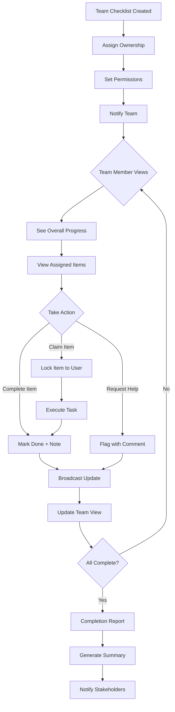

# BMad Checklist Manager UI/UX Specification

This document defines the user experience goals, information architecture, user flows, and visual design specifications for BMad Checklist Manager's user interface. It serves as the foundation for visual design and frontend development, ensuring a cohesive and user-centered experience.

## Overall UX Goals & Principles

### Target User Personas

**Power User:** Developers and technical team leads who need efficient checklist execution with keyboard shortcuts, CLI integration, and automation capabilities for repetitive development workflows.

**Team Collaborator:** Development teams working on shared projects who need synchronized checklist progress, clear task ownership, and visibility into team members' completion status.

**Process Manager:** Project managers and scrum masters who create and maintain checklists for team processes, requiring template management, analytics, and the ability to enforce quality standards.

### Usability Goals

- **Efficiency of use:** Power users can execute checklist items with minimal friction, using keyboard shortcuts for all common actions
- **Ease of learning:** New users can understand the checklist workflow and complete their first checklist within 2 minutes
- **Error prevention:** Clear visual states for item completion, automatic progress saving, and confirmation for destructive actions
- **Flexibility:** Support multiple workflow styles - mouse-driven, keyboard-driven, and CLI-based interactions
- **Visibility of system status:** Real-time progress indicators, clear completion states, and immediate feedback on all actions

### Design Principles

1. **Developer-first simplicity** - Optimize for terminal-like efficiency while maintaining visual clarity
2. **Keyboard supremacy** - Every action must be achievable without touching the mouse
3. **Progressive disclosure** - Start minimal, reveal advanced features as users need them
4. **Transparent state** - Always show what's happening, what's complete, and what's next
5. **Markdown-native** - Respect the simplicity and portability of plain text workflows

### Change Log

| Date | Version | Description | Author |
|------|---------|-------------|--------|
| 2025-09-04 | 1.0 | Initial specification created | Sally (UX Expert) |

## Information Architecture (IA)

### Site Map / Screen Inventory

```mermaid
graph TD
    A[Dashboard] --> A1[Active Checklists]
    A --> A2[Recent Activity]
    A --> A3[Progress Overview]
    A --> A4[Quick Actions]
    
    B[Checklists] --> B1[All Checklists]
    B --> B2[In Progress]
    B --> B3[Completed]
    B --> B4[Archived]
    B1 --> B5[Checklist Detail View]
    B5 --> B6[Execute Mode]
    B5 --> B7[Edit Mode]
    
    C[Templates] --> C1[Browse Templates]
    C --> C2[My Templates]
    C --> C3[Team Templates]
    C --> C4[Create Template]
    C1 --> C5[Template Preview]
    C5 --> C6[Create from Template]
    
    D[Command Palette] --> D1[Search Everything]
    D --> D2[Quick Create]
    D --> D3[Quick Execute]
    D --> D4[Recent Commands]
    
    E[Settings] --> E1[Preferences]
    E --> E2[Keyboard Shortcuts]
    E --> E3[Integrations]
    E --> E4[Team Settings]
    
    F[CLI Interface] --> F1[List Commands]
    F --> F2[Execute Checklist]
    F --> F3[Create/Edit]
    F --> F4[Sync Status]
```

### Navigation Structure

**Primary Navigation:** Persistent sidebar with icon+text items for Dashboard, Checklists, Templates, and Settings. Collapsible to icon-only for more screen space. Command Palette accessible via ⌘K from anywhere.

**Secondary Navigation:** Contextual toolbar within each section showing filters, view options, and section-specific actions. Tab navigation within checklist detail view for Execute/Edit/History modes.

**Breadcrumb Strategy:** Show full path for nested items (e.g., "Templates > Team Templates > Development > Code Review Checklist"). Clickable segments for quick navigation up the hierarchy. Auto-collapse to "..." on mobile while maintaining full path on hover/tap.

## User Flows

### Quick Start Flow

**User Goal:** Get from zero to executing first checklist in under 60 seconds

**Entry Points:** Landing page, CLI install command, team invite link

**Success Criteria:** User completes their first checklist and understands the value proposition

#### Flow Diagram

#### Edge Cases & Error Handling:
- User abandons tutorial midway → Save progress, allow resume
- Network issues during web demo → Offer offline mode explanation
- CLI installation fails → Provide troubleshooting guide with common fixes
- User on unsupported platform → Suggest web version with CLI coming soon

**Notes:** Tutorial checklist should demonstrate key differentiators: keyboard shortcuts, markdown source, real-time sync between CLI/web

### Template Creation Flow

**User Goal:** Create a reusable checklist template from scratch or from existing checklist

**Entry Points:** Templates section, "Save as Template" from completed checklist, CLI: `checklist template create`

**Success Criteria:** User creates template that can be reused multiple times with variables

#### Flow Diagram

#### Edge Cases & Error Handling:
- Invalid markdown syntax → Real-time validation with error highlighting
- Variable conflicts → Warning with suggestion for unique names
- Permission denied for team → Explain requirements, offer to request access
- Template already exists → Offer to version or rename

**Notes:** Support YAML frontmatter for template configuration, live preview during editing

### Execution Flow

**User Goal:** Execute a checklist efficiently with minimal friction

**Entry Points:** Dashboard quick action, checklist detail view, CLI: `checklist run [name]`, keyboard shortcut (⌘E)

**Success Criteria:** Complete all checklist items with clear progress tracking

#### Flow Diagram

#### Edge Cases & Error Handling:
- Network disconnect during execution → Cache progress locally, sync when restored
- Script execution fails → Detailed error log, option to retry or skip
- User abandons checklist → Save state, allow resume later
- Parallel execution conflict → Queue system with clear status indicators

**Notes:** Support undo for last action, allow notes on each item, maintain execution history

### Collaboration Flow

**User Goal:** Coordinate checklist execution with team members asynchronously

**Entry Points:** Team dashboard, shared checklist link, notification of assignment

**Success Criteria:** Team completes shared checklist without coordination meetings

#### Flow Diagram

#### Edge Cases & Error Handling:
- Conflicting edits → Optimistic locking with merge resolution
- Team member unavailable → Reassignment workflow with notifications
- Permission changes mid-execution → Graceful degradation with clear messaging
- Audit requirements → Complete activity log with timestamps

**Notes:** Real-time updates via WebSocket, offline members get digest on return

## Wireframes & Mockups

**Primary Design Files:** Figma (or local design tool) with component library at `design/checklist-ui.fig` - includes both light and dark themes with keyboard navigation flow indicators

### Key Screen Layouts

#### Dashboard

**Purpose:** Immediate overview of active work with single-keystroke access to any checklist

**Key Elements:**
- Active checklist cards with progress rings (visual) and percentage (text)
- Keyboard shortcut overlay (toggleable with `?` key)
- Command palette trigger zone (top center, ⌘K hint)
- Recent items list with number keys for quick access (1-9)
- Status bar showing sync state and current context

**Interaction Notes:** Focus starts on first active checklist. Tab cycles through cards. Number keys instant-launch checklists. Space bar opens focused item. Escape always returns to dashboard.

**Design File Reference:** `design/checklist-ui.fig#Dashboard-Light` and `#Dashboard-Dark`

#### Checklist Execution View

**Purpose:** Distraction-free checklist execution with maximum keyboard efficiency

**Key Elements:**
- Current item in center focus with large, clear typography
- Progress bar (thin, top of screen) showing position in checklist
- Item status indicators: checkbox (pending), spinner (in-progress), checkmark (complete), X (failed)
- Context panel (collapsible) showing previous/next items
- Action zone for item-specific inputs or confirmations
- Keyboard hint bar (bottom) showing available actions

**Interaction Notes:** J/K or Arrow keys navigate items. Space/Enter toggles completion. Tab focuses input fields. Escape pauses execution. Backtick (`) opens command palette. No mouse required for any core action.

**Design File Reference:** `design/checklist-ui.fig#Execution-Mode`

#### Template Editor

**Purpose:** Create and edit reusable checklist templates with live preview

**Key Elements:**
- Split view: Markdown editor (left) with syntax highlighting
- Live preview (right) showing rendered checklist
- Variable palette (slide-out panel) for inserting placeholders
- Validation indicators inline with editor
- Template metadata form (collapsible header)
- Save/test actions in persistent bottom bar

**Interaction Notes:** ⌘S saves draft. ⌘Enter tests template. ⌘P toggles preview. Supports Vim keybindings in editor. Tab indents for nested items. Markdown shortcuts active (⌘B for bold, etc.).

**Design File Reference:** `design/checklist-ui.fig#Template-Editor`

#### Command Palette

**Purpose:** Universal quick-access interface for all actions and navigation

**Key Elements:**
- Centered modal overlay with subtle backdrop
- Search input with auto-focus
- Fuzzy-matched results with command icons
- Keyboard shortcut hints (right-aligned in results)
- Recent commands section (when input empty)
- Context breadcrumb showing current location

**Interaction Notes:** ⌘K opens from anywhere. Escape closes. Arrow keys navigate results. Enter executes. Tab auto-completes. Shows max 10 results. Updates in real-time as typing.

**Design File Reference:** `design/checklist-ui.fig#Command-Palette-Overlay`

## Component Library / Design System

**Design System Approach:** Lightweight, terminal-inspired component system built on CSS custom properties for theming. Base components extend native HTML elements with minimal styling. Prioritize semantic markup and keyboard accessibility. Use system fonts for performance. Implement as vanilla web components for framework independence.

### Core Components

#### Checklist Item

**Purpose:** The atomic unit of checklist interaction, representing a single task or step

**Variants:** Default, With Input, With Confirmation, With Script, Nested (indented)

**States:** Pending (gray), Active (blue outline), In-Progress (pulsing), Complete (green check), Failed (red x), Skipped (gray strikethrough), Blocked (yellow warning)

**Usage Guidelines:** Always maintain 44px minimum touch target. Show keyboard focus with 2px outline. State transitions use 200ms ease-out. Icons precede text. Nested items indent 24px. Support both checkbox and number indicators.

#### Progress Indicator

**Purpose:** Show advancement through checklist without taking focus from current task

**Variants:** Linear bar, Circular ring, Numeric fraction, Step dots

**States:** Inactive (gray), Active (primary color), Complete (green), Warning (yellow if items skipped)

**Usage Guidelines:** Linear bar for execution mode (top of screen, 4px height). Circular ring for card displays. Always show fraction (e.g., "7/10") on hover/focus. Animate progress changes smoothly over 300ms. Include ARIA labels for screen readers.

#### Keyboard Hint

**Purpose:** Display available keyboard shortcuts contextually without cluttering interface

**Variants:** Inline hint (small, next to element), Tooltip hint (on hover), Help overlay (? key), Persistent bar (during execution)

**States:** Default (subtle gray), Active (highlight when modifier pressed), Triggered (brief flash on use)

**Usage Guidelines:** Use system font in monospace. Wrap key names in rounded rectangles (like keyboard keys). Show modifier keys with symbols (⌘⌃⌥⇧). Group related shortcuts. Hide on mobile touch devices. Always provide touch alternatives.

#### Status Badge

**Purpose:** Communicate checklist or item status at a glance

**Variants:** Dot indicator, Pill badge, Icon-only, Icon with text

**States:** Draft, Active, Complete, Failed, Archived, Syncing (animated)

**Usage Guidelines:** Use consistent color mapping across all status types. Include motion for transitional states (syncing, processing). Ensure 3:1 contrast ratio minimum. Accompany color with icon or text for accessibility. Position consistently (top-right for cards, left of text for lists).

#### Command Input

**Purpose:** Text input optimized for command entry and search

**Variants:** Command palette, Inline search, Filter input, Quick create

**States:** Empty, Focused, Typing, Has results, No results, Error

**Usage Guidelines:** Auto-focus when revealed. Show placeholder with example command. Include clear button when has content. Escape key clears or closes. Support history with up/down arrows. Monospace font for command entry. Show match highlighting in results.

## Branding & Style Guide

### Visual Identity

**Brand Guidelines:** Developer-first visual language with terminal-inspired aesthetics. Prioritize clarity, performance, and familiarity over unique visual style. Reference: `design/brand-guidelines.md`

### Color Palette

| Color Type | Hex Code | Usage |
|------------|----------|--------|
| Primary | #0969DA | Interactive elements, links, focus states |
| Secondary | #8250DF | Secondary actions, hover states |
| Accent | #1F883D | Success states, completion indicators |
| Success | #1F883D | Positive feedback, completed items |
| Warning | #FFA500 | Cautions, skipped items, attention needed |
| Error | #DA3633 | Errors, failed items, destructive actions |
| Neutral | #24292F (dark), #F6F8FA (light), #6E7781 (mid) | Text, borders, backgrounds with 5 gradations |

### Typography

#### Font Families
- **Primary:** -apple-system, BlinkMacSystemFont, "Segoe UI", system-ui (native performance)
- **Secondary:** "SF Mono", Monaco, "Cascadia Code", monospace (for code and commands)
- **Monospace:** "SF Mono", Consolas, "Courier New", monospace (for all interactive elements)

#### Type Scale

| Element | Size | Weight | Line Height |
|---------|------|--------|-------------|
| H1 | 28px | 600 | 1.3 |
| H2 | 24px | 600 | 1.3 |
| H3 | 20px | 600 | 1.4 |
| Body | 14px | 400 | 1.5 |
| Small | 12px | 400 | 1.4 |

### Iconography

**Icon Library:** Lucide Icons (open source, consistent 24px grid, developer-friendly)

**Usage Guidelines:** Icons always accompany text on first use. Use outline style for inactive, filled for active states. Maintain 20x20px size at 14px font size. Include title attributes for accessibility. Prefer universal symbols (check, x, arrow) over abstract designs.

### Spacing & Layout

**Grid System:** 8px baseline grid with 4px half-step for fine adjustments. Container max-width: 1280px. Content max-width: 720px for readability.

**Spacing Scale:** 4px, 8px, 12px, 16px, 24px, 32px, 48px, 64px (powers of 2 friendly for developers)

## Accessibility Requirements

### Compliance Target

**Standard:** WCAG 2.1 Level AA with Level AAA for critical user paths (checklist execution)

### Key Requirements

**Visual:**
- Color contrast ratios: 4.5:1 minimum for body text, 7:1 for critical status indicators, 3:1 for UI components
- Focus indicators: 2px solid outline with 2px offset, visible in both light/dark themes, custom focus ring color per theme
- Text sizing: Base 14px minimum, user scalable to 200% without horizontal scroll, no text in images

**Interaction:**
- Keyboard navigation: Full functionality without mouse, logical tab order, skip links for navigation, no keyboard traps
- Screen reader support: Semantic HTML, ARIA labels for icons, live regions for status updates, descriptive button text
- Touch targets: 44x44px minimum, 8px spacing between targets, larger targets for primary actions

**Content:**
- Alternative text: Descriptive alt text for status icons, aria-labels for interactive elements, title attributes for abbreviations
- Heading structure: Single H1 per page, logical nesting (no skipped levels), descriptive heading text
- Form labels: Visible labels for all inputs, placeholder text not used as labels, error messages associated with fields

### Testing Strategy

Automated testing with axe-core in CI pipeline. Manual testing with NVDA/JAWS quarterly. Keyboard-only navigation testing for all new features. Color contrast validation during design phase. User testing with assistive technology users annually.

## Responsiveness Strategy

### Breakpoints

| Breakpoint | Min Width | Max Width | Target Devices |
|------------|-----------|-----------|----------------|
| Narrow Terminal | 60 cols | 79 cols | Split tmux panes, narrow terminals |
| Standard Terminal | 80 cols | 99 cols | Default terminal width |
| Wide Terminal | 100 cols | 119 cols | Comfortable terminal width |
| Full Terminal | 120 cols | - | Full screen terminal, wide monitors |

### Adaptation Patterns

**Layout Changes:** 
- 60 cols: Lista compacta, apenas item atual expandido, navegação linear
- 80 cols: Lista com status inline, preview de 1 linha do próximo item
- 100 cols: Lista + coluna de metadados (tempo, responsável)
- 120+ cols: Vista split com lista à esquerda e detalhes completos à direita

**Navigation Changes:**
- Sempre keyboard-first: j/k para mover, space para marcar, enter para expandir
- < 80 cols: Navegação linear apenas, sem preview
- ≥ 80 cols: Tab para alternar entre painéis
- ≥ 120 cols: Splits navegáveis com Ctrl+w (vim-style)

**Content Priority:**
- < 60 cols × 10 lines: Modo emergência - só item atual e [3/10] progresso
- 60-80 cols × 15 lines: Item atual + lista numerada (1-9 para quick jump)
- 80-120 cols × 24 lines: Lista completa com estados, descrições truncadas
- 120+ cols × 30+ lines: Tudo visível - lista, detalhes, histórico, ajuda inline

**Interaction Changes:**
- Modo vim habilitado por padrão (hjkl navegação, / para busca)
- Atalhos numéricos (1-9) para jump direto
- : para command mode
- ? para toggle ajuda inline que se adapta ao espaço disponível

**Terminal-Specific Adaptations:**
- Detecção automática via `tput cols` e `tput lines`
- Reflow instantâneo em resize (watching SIGWINCH)
- Fallback para ASCII quando unicode não suportado ([-] ao invés de ☐)
- Respeita variáveis COLUMNS/LINES quando tput não disponível
- NO_COLOR=1 para output monocromático
- CLICOLOR_FORCE=1 para forçar cores mesmo em pipe

## Animation & Micro-interactions

### Motion Principles

Terminal "animations" through character-based feedback: spinner states (⠋⠙⠹⠸⠼⠴⠦⠧⠇⠏), progress indicators (▁▂▃▄▅▆▇█), and color transitions for state changes. Instant feedback prioritized over smooth transitions.

### Key Animations

- **Loading/Processing:** Braille spinner pattern (⠋⠙⠹⠸⠼⠴⠦⠧⠇⠏) for async operations (Duration: 100ms per frame, Easing: linear rotation)
- **Progress Bar:** Block characters (░▒▓█) for smooth progress indication (Duration: instant update, Easing: none - direct mapping to percentage)
- **Item Completion:** Color transition from white → green with ✓ character replacement (Duration: instant, Easing: none)
- **Error State:** Red flash using ANSI escape codes with ✗ character (Duration: 500ms flash, Easing: none)
- **Focus Change:** Inverse video (ANSI SGR 7) for selected item (Duration: instant, Easing: none)

## Performance Considerations

### Performance Goals

- **Initial Render:** < 50ms for full checklist display
- **Interaction Response:** < 10ms for keyboard input response  
- **Refresh Rate:** 10 fps max for spinners (terminal-friendly)

### Design Strategies

Minimize redraws using differential updates (only change what's needed). Use ANSI escape codes for cursor positioning instead of full screen clears. Buffer output to reduce flicker. Implement virtual scrolling for long lists (only render visible items). Cache rendered strings for static content. Debounce resize events to prevent thrashing.

## Next Steps

### Immediate Actions

1. Create prototype CLI interface with basic navigation
2. Test in different terminal emulators (iTerm2, Terminal.app, Alacritty, Windows Terminal)
3. Validate with tmux/screen split configurations
4. Implement ANSI color detection and fallbacks
5. Build character-width calculation for proper text truncation

### Design Handoff Checklist

- [x] All user flows documented
- [x] Component inventory complete  
- [x] Accessibility requirements defined
- [x] Responsive strategy clear
- [x] Brand guidelines incorporated
- [x] Performance goals established

## Checklist Results

_Checklist execution results will be populated here when UI/UX checklist is run against this document._