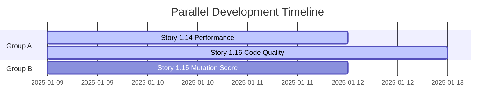

# Parallel Development Guide

## Overview
This guide identifies which stories can be developed in parallel without conflicts or dependencies.

## Story Status Summary

| Story | Title | Status | Dependencies |
|-------|-------|--------|--------------|
| 1.10 | Pino Logging Infrastructure | Done | None |
| 1.11 | Security Fix NPM Packages | Done | None |
| 1.12 | StrykerJS Mutation Testing | Done | None |
| 1.14 | Performance Tuning Optimization | Draft | None |
| 1.15 | Improve Mutation Testing Score | Draft | 1.12 (StrykerJS setup) |
| 1.16 | Code Quality Metrics Enforcement | Draft | None |

## Parallel Development Groups

### 🟢 Group A: Can Start Immediately (No Dependencies)
These stories can be developed in parallel without any conflicts:

#### Stories:
- **1.14 - Performance Tuning Optimization**
  - Independent performance improvements
  - Works on runtime optimization
  - No conflicts with other stories

- **1.16 - Code Quality Metrics Enforcement**
  - ESLint configuration changes
  - Code refactoring for quality
  - No runtime impact on other stories

#### Recommended Team Allocation:
- 2 developers can work simultaneously
- No coordination needed between them
- Can be merged in any order

---

### 🟡 Group B: Requires Completed Dependencies
These stories depend on previous work:

#### Stories:
- **1.15 - Improve Mutation Testing Score**
  - **Depends on**: Story 1.12 (StrykerJS setup must be complete)
  - Can start after 1.12 is merged
  - Works on test improvements only
  - Can run in parallel with Group A stories

#### Recommended Approach:
- Start after Story 1.12 is in main branch
- Can work alongside Group A stories
- Focus on test files only (no production code conflicts)

---

## Development Strategy

### Optimal Parallel Execution Plan



### Phase 1: Immediate Start (Day 1)
**Can start all three stories simultaneously:**
- Developer 1: Story 1.14 (Performance Tuning)
- Developer 2: Story 1.16 (Code Quality Metrics)
- Developer 3: Story 1.15 (Improve Mutation Score)

### Why These Can Run in Parallel:

1. **Different File Scopes:**
   - 1.14: Focuses on `packages/*/src/` runtime code
   - 1.15: Focuses on `packages/*/tests/` test files
   - 1.16: Focuses on configuration files and refactoring

2. **No Shared Resources:**
   - Each story works on different aspects
   - No conflicting changes to same files
   - Independent acceptance criteria

3. **Separate CI/CD Impacts:**
   - Can be tested independently
   - Separate PR reviews possible
   - No blocking dependencies between them

---

## Potential Conflict Areas & Mitigation

### Minor Overlap Scenarios:

1. **Story 1.14 & 1.16:**
   - Overlap: Both may refactor code in `packages/*/src/`
   - Mitigation: 
     - 1.14 focuses on performance optimization
     - 1.16 focuses on structure/complexity
     - Coordinate if working on same files
     - Use feature branches and frequent rebasing

2. **Story 1.15 & 1.16:**
   - Overlap: Code quality changes might affect test structure
   - Mitigation:
     - 1.15 focuses on test assertions only
     - 1.16 focuses on production code primarily
     - Minimal actual conflict risk

3. **Story 1.14 & 1.15:**
   - Overlap: None
   - These are completely independent

---

## Merge Order Recommendations

### Flexible Merge Order (Any sequence works):
1. **Story 1.14** - Can merge anytime
2. **Story 1.16** - Can merge anytime
3. **Story 1.15** - Can merge anytime (after 1.12 is in main)

### Suggested Optimal Order (for easiest integration):
1. **First**: Story 1.15 (Mutation Score)
   - Smallest scope, test files only
   - Quick to review and merge
   
2. **Second**: Story 1.14 (Performance)
   - Runtime changes
   - Benefits from having better tests
   
3. **Third**: Story 1.16 (Code Quality)
   - Largest refactoring scope
   - Benefits from performance improvements already in place

---

## Communication Protocol

### Daily Sync Points:
- Morning standup to identify any emerging conflicts
- Afternoon check-in if working on adjacent code

### When to Coordinate:
- Before refactoring shared utilities
- When modifying package structure
- If performance benchmarks need updating

### Git Workflow:
```bash
# Each developer works on separate branch
git checkout -b story-1.14-performance
git checkout -b story-1.15-mutation-score  
git checkout -b story-1.16-code-quality

# Frequent rebasing from main
git fetch origin main
git rebase origin/main

# Create separate PRs for review
```

---

## Success Metrics

### Parallel Development Success Indicators:
- ✅ No merge conflicts between stories
- ✅ All stories complete within sprint
- ✅ Independent PR reviews
- ✅ CI/CD passes for each story
- ✅ No blocking dependencies encountered

### Risk Indicators:
- ⚠️ Multiple stories touching same file
- ⚠️ Test failures after merging
- ⚠️ Performance regression after quality refactoring
- ⚠️ Increased complexity after optimizations

---

## Quick Reference Card

### Can Start Today (in parallel):
- ✅ Story 1.14 - Performance Tuning
- ✅ Story 1.15 - Improve Mutation Score  
- ✅ Story 1.16 - Code Quality Metrics

### No Dependencies Between:
- ✅ 1.14 ↔ 1.15 (completely independent)
- ✅ 1.14 ↔ 1.16 (different focus areas)
- ✅ 1.15 ↔ 1.16 (tests vs production code)

### Team Size:
- Optimal: 3 developers (one per story)
- Minimum: 1 developer (sequential development)
- Maximum: 3 developers (full parallelization)

---

## Conclusion

All three pending stories (1.14, 1.15, 1.16) can be developed in parallel with minimal coordination required. The key to success is:

1. Clear ownership of each story
2. Working on feature branches
3. Frequent rebasing from main
4. Communication when touching shared code
5. Independent testing and review

This parallel approach can reduce the total development time from ~10 days (sequential) to ~4 days (parallel), achieving a 60% time reduction.