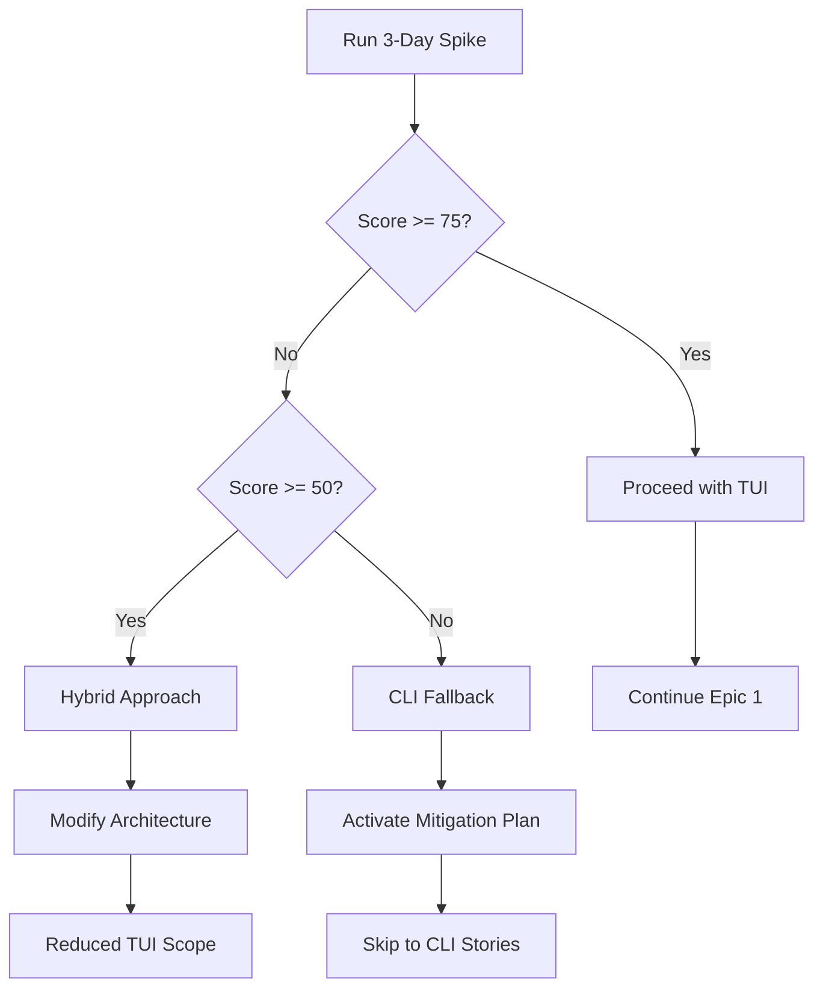

# Story 1.4: TUI Technology Spike ⚠️ CRITICAL PATH

## Story

**As a** developer,  
**I want** to validate the hybrid TUI approach with a working prototype,  
**so that** we confirm technical feasibility before committing to full implementation.

## Priority

**CRITICAL** - This blocks all TUI-related stories. Has mitigation plan if fails.

## Spike Goals

1. Validate Bun compatibility with TUI rendering
2. Confirm performance targets are achievable
3. Test cross-platform compatibility
4. Determine best technical approach

## Acceptance Criteria

### Three Approaches to Test

#### Approach 1: Ink (React-based)

```typescript
// Test Ink compatibility with Bun
import React from 'react';
import {render, Box, Text} from 'ink';

const TestApp = () => (
  <Box flexDirection="column">
    <Text color="green">✓ Ink works with Bun</Text>
    <Text>Performance: {measurePerformance()}ms</Text>
  </Box>
);

// Measure: startup time, memory, 1000-item render
```

#### Approach 2: Pure ANSI/Custom

```typescript
// Custom ANSI implementation
class ANSIRenderer {
  private buffer: string[] = [];

  clearScreen(): void {
    this.buffer.push('\x1b[2J\x1b[H');
  }

  renderList(items: string[], selected: number): void {
    items.forEach((item, i) => {
      if (i === selected) {
        this.buffer.push(`\x1b[7m${item}\x1b[27m`); // Inverse
      } else {
        this.buffer.push(item);
      }
      this.buffer.push('\n');
    });
  }

  flush(): void {
    process.stdout.write(this.buffer.join(''));
    this.buffer = [];
  }
}
```

#### Approach 3: Hybrid (Blessed-like)

```typescript
// Minimal blessed-like approach
import * as blessed from 'neo-blessed';

const screen = blessed.screen({
  smartCSR: true,
  dockBorders: true,
});

const list = blessed.list({
  parent: screen,
  width: '50%',
  height: '100%',
  items: generateTestItems(1000),
  scrollable: true,
  mouse: true,
  keys: true,
});
```

### Performance Benchmarks Required

| Metric             | Target | Maximum | Test Method                |
| ------------------ | ------ | ------- | -------------------------- |
| Startup Time       | 30ms   | 50ms    | Time to first render       |
| 1000 Item Render   | 50ms   | 100ms   | Full list display          |
| Memory Usage       | 30MB   | 50MB    | After rendering 1000 items |
| Scroll Performance | 60fps  | 30fps   | Smooth scroll test         |
| Resize Response    | 100ms  | 200ms   | Terminal resize handling   |

### Compatibility Matrix

| Platform | Terminal         | Required | Test Command                   |
| -------- | ---------------- | -------- | ------------------------------ |
| macOS    | Terminal.app     | ✅       | `bun test:spike:mac`           |
| macOS    | iTerm2           | ✅       | `bun test:spike:mac`           |
| Linux    | GNOME Terminal   | ✅       | `bun test:spike:linux`         |
| Windows  | Windows Terminal | ✅       | `bun test:spike:win`           |
| All      | SSH Session      | ✅       | `ssh localhost bun test:spike` |
| All      | tmux             | ✅       | `tmux new bun test:spike`      |

### Test Implementation

```typescript
// spike-test.ts
import { performance } from 'perf_hooks';

interface SpikeResult {
  approach: string;
  success: boolean;
  metrics: {
    startupTime: number;
    renderTime: number;
    memoryUsed: number;
    fps: number;
  };
  issues: string[];
}

async function runSpike(): Promise<SpikeResult[]> {
  const results: SpikeResult[] = [];

  // Test each approach
  for (const approach of [testInk, testANSI, testHybrid]) {
    const start = performance.now();

    try {
      const result = await approach();
      results.push(result);
    } catch (error) {
      results.push({
        approach: approach.name,
        success: false,
        metrics: null,
        issues: [error.message],
      });
    }
  }

  return results;
}

// Decision matrix
function evaluateResults(results: SpikeResult[]): Decision {
  const scores = results.map((r) => ({
    approach: r.approach,
    score: calculateScore(r),
  }));

  const winner = scores.sort((a, b) => b.score - a.score)[0];

  if (winner.score >= 75) {
    return { decision: 'PROCEED', approach: winner.approach };
  } else if (winner.score >= 50) {
    return { decision: 'HYBRID', approach: winner.approach };
  } else {
    return { decision: 'CLI_FALLBACK', approach: null };
  }
}
```

## Success Criteria Evaluation

### Scoring Rubric (100 points total)

- **Performance (40 points)**
  - Startup <50ms: 10pts
  - Render <100ms: 15pts
  - Memory <50MB: 15pts
- **Compatibility (30 points)**
  - Works on all platforms: 15pts
  - Works with Bun: 15pts
- **Functionality (20 points)**
  - Scrolling works: 5pts
  - Keyboard navigation: 5pts
  - Resize handling: 5pts
  - No flicker: 5pts
- **Maintainability (10 points)**
  - Code complexity: 5pts
  - Dependency count: 5pts

## Go/No-Go Decision Tree



## Spike Deliverables

1. **Spike Report** (`spike-results.md`)
   - Performance metrics for each approach
   - Compatibility matrix filled out
   - Recommended approach with justification
   - Risk assessment

2. **Proof of Concept** (`poc/`)
   - Working code for recommended approach
   - Benchmark scripts
   - Cross-platform test results

3. **Decision Document** (`decision-tui.md`)
   - Go/No-Go recommendation
   - If No-Go: Activation of mitigation plan
   - Architecture updates needed

## Time Box

**3 days maximum** - Hard stop for decision

### Day 1: Implementation

- Morning: Set up test harness
- Afternoon: Implement three approaches

### Day 2: Testing

- Morning: Performance testing
- Afternoon: Compatibility testing

### Day 3: Decision

- Morning: Analysis and scoring
- Afternoon: Decision meeting and documentation

## Risk Mitigation

See [TUI Spike Mitigation Plan](../tui-spike-mitigation-plan.md) for fallback strategy.

## Definition of Done

- [ ] All three approaches tested
- [ ] Performance metrics collected
- [ ] Compatibility matrix complete
- [ ] Decision documented
- [ ] If failure: Mitigation plan activated
- [ ] Architecture updated based on decision

## Notes

- This is a time-boxed spike - do not extend beyond 3 days
- Have CLI fallback ready to activate
- Document all issues encountered for future reference
- Consider partial success as valid outcome
