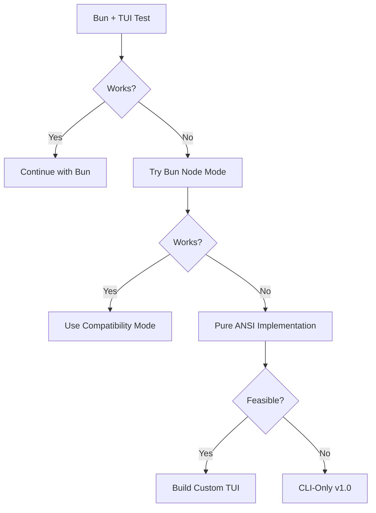

# TUI Technology Spike - Failure Mitigation Plan

## Risk Overview

Story 1.2 (TUI Technology Spike) is marked as **CRITICAL PATH** with potential for complete failure. This document outlines mitigation strategies and fallback plans to ensure project continuity.

## Spike Success Criteria

The TUI spike will be considered successful if:

- ✅ Renders 1000+ items with <50ms response time
- ✅ Memory usage stays under 50MB
- ✅ Works on macOS, Linux, and Windows (WSL)
- ✅ Supports keyboard navigation
- ✅ Compiles with Bun to standalone binary

## Failure Scenarios & Mitigations

### Scenario 1: Performance Failure

**Issue:** TUI cannot meet <100ms response time requirement

**Mitigation Strategy:**

1. **Immediate:** Implement aggressive virtual scrolling (render only visible items)
2. **Short-term:** Reduce animation/refresh rates
3. **Medium-term:** Implement progressive rendering
4. **Fallback:** CLI-only mode with pagination

**Code Approach:**

```typescript
// Fallback to CLI pagination if TUI fails
export class CLIPaginatedView implements IChecklistView {
  private pageSize = 10;

  async render(items: ChecklistItem[]): Promise<void> {
    const pages = Math.ceil(items.length / this.pageSize);
    // Simple pagination without TUI complexity
  }
}
```

### Scenario 2: Bun Compatibility Failure

**Issue:** TUI libraries don't work with Bun runtime

**Mitigation Strategy:**

1. **Immediate:** Test with Node.js compatibility mode
2. **Short-term:** Use Bun's Node.js polyfills
3. **Medium-term:** Build custom ANSI-only renderer
4. **Fallback:** Ship as Node.js application initially

**Decision Tree:**



### Scenario 3: Cross-Platform Failure

**Issue:** TUI works on macOS but fails on Windows/Linux

**Mitigation Strategy:**

1. **Immediate:** Detect platform and provide CLI fallback
2. **Short-term:** Platform-specific binaries
3. **Medium-term:** Web-based alternative
4. **Fallback:** CLI-first with optional TUI

**Implementation:**

```typescript
export class AdaptiveInterface {
  static async create(): Promise<IInterface> {
    if (await this.detectTUISupport()) {
      return new TUIInterface();
    }
    console.warn('TUI not supported, falling back to CLI');
    return new CLIInterface();
  }

  private static async detectTUISupport(): Promise<boolean> {
    // Check terminal capabilities
    const hasColor = process.stdout.hasColors?.() ?? false;
    const hasUnicode = process.env.LANG?.includes('UTF-8') ?? false;
    const termProgram = process.env.TERM_PROGRAM;

    return hasColor && hasUnicode && !process.env.CI;
  }
}
```

## Progressive Delivery Strategy

### Phase 1: CLI-Only (Week 1-2)

**If TUI spike fails completely:**

- Ship fully functional CLI interface
- All features available via commands
- Focus on core workflow engine
- No TUI dependencies

```bash
# Full functionality without TUI
checklist init
checklist status
checklist next
checklist done
checklist --help
```

### Phase 2: Simple TUI (Week 3-4)

**If partial TUI success:**

- Basic list navigation (up/down arrows)
- Simple status display
- No split panes or complex layouts
- ASCII-only characters

### Phase 3: Enhanced TUI (Week 5-6)

**If TUI spike succeeds:**

- Full split-pane interface
- Rich interactions
- Unicode support
- Smooth animations

## Alternative Approaches Ranking

| Approach                  | Complexity | Risk   | Performance | Recommendation        |
| ------------------------- | ---------- | ------ | ----------- | --------------------- |
| 1. Pure ANSI/Escape Codes | Low        | Low    | Excellent   | ✅ PREFERRED FALLBACK |
| 2. CLI with Pagination    | Very Low   | None   | Excellent   | ✅ SAFE FALLBACK      |
| 3. Node.js + Ink          | Medium     | Medium | Good        | ⚠️ IF BUN FAILS       |
| 4. Web UI                 | High       | Low    | Good        | ❌ SCOPE CREEP        |
| 5. Electron App           | Very High  | Medium | Poor        | ❌ AVOID              |

## Go/No-Go Decision Matrix

### After 3-Day Spike:

| Criteria             | Weight | Success      | Partial           | Failure  |
| -------------------- | ------ | ------------ | ----------------- | -------- |
| Performance (<100ms) | 30%    | Continue TUI | Optimize          | CLI-only |
| Memory (<50MB)       | 20%    | Continue TUI | Optimize          | CLI-only |
| Cross-platform       | 25%    | Continue TUI | Platform-specific | CLI-only |
| Bun compatible       | 25%    | Continue TUI | Node.js fallback  | CLI-only |

**Decision Rules:**

- **>75% Success:** Proceed with full TUI
- **50-75% Success:** Implement hybrid approach
- **<50% Success:** CLI-only for v1.0

## Contingency Budget

If TUI spike fails:

- **Time saved:** 2-3 weeks of TUI development
- **Reallocation:**
  - 1 week: Enhanced CLI experience
  - 1 week: Additional testing
  - 1 week: Documentation and polish

## Communication Plan

### If Spike Fails:

1. **Day 3:** Team meeting to discuss findings
2. **Day 4:** Stakeholder communication with revised approach
3. **Day 5:** Update PRD and architecture docs
4. **Day 6:** Begin CLI-enhanced implementation

### Key Messages:

- "CLI-first ensures faster delivery and better stability"
- "TUI can be added in v2.0 based on user feedback"
- "Core value (workflow management) unchanged"
- "Reduced complexity means faster feature delivery"

## Technical Debt Considerations

### If using CLI fallback:

- Design interfaces to support future TUI
- Keep rendering logic separate from business logic
- Document TUI requirements for future implementation
- Maintain clean separation of concerns

```typescript
// Design for future TUI compatibility
interface IRenderer {
  render(state: ChecklistState): Promise<void>;
}

class CLIRenderer implements IRenderer {
  /* ... */
}
class TUIRenderer implements IRenderer {
  /* ... */
} // Future
```

## Success Metrics for Fallback

If we proceed with CLI-only:

- ✅ Full feature parity with planned TUI version
- ✅ Sub-50ms response times (easier without TUI)
- ✅ <20MB binary size
- ✅ 100% keyboard accessible (by design)
- ✅ Works everywhere Node.js/Bun runs

## Final Recommendation

**Start with CLI-first development in parallel with TUI spike:**

1. Build core engine with no UI dependencies (already planned)
2. Implement full CLI interface alongside TUI spike
3. If TUI succeeds, CLI becomes fallback/automation mode
4. If TUI fails, CLI is already production-ready

This approach ensures **zero project delay** regardless of spike outcome.

## Appendix: Quick CLI Implementation

```typescript
// Minimal viable CLI that can ship in 1 week
export class QuickCLI {
  async run(args: string[]): Promise<void> {
    const command = args[0];

    switch (command) {
      case 'init':
        await this.init(args[1]);
        break;
      case 'next':
        await this.showNextItem();
        break;
      case 'done':
        await this.markCurrentDone();
        break;
      case 'status':
        await this.showStatus();
        break;
      default:
        this.showHelp();
    }
  }

  private async showStatus(): Promise<void> {
    const state = await this.loadState();
    console.log(`📍 ${state.currentStep.title}`);
    console.log(`📊 Progress: ${state.completed}/${state.total}`);
    console.log(`⏱️  Time on current: ${state.timeOnCurrent}`);
  }
}
```

This ensures we can ship value even in worst-case scenario.
